# René-Marc's Home Assistant configuration

[![Build Status][img-travis-ci]][link-travis-ci]
[![GitHub Release][img-github-release]][link-repo]
[![Hass.io][img-hassio]][link-hassio]
[![Home Assistant version][img-ha-version]][link-ha-version]
[![License][img-license]][link-license]

Configuration for [Home Assistant](https://home-assistant.io/) running [Hass.io](https://home-assistant.io/hassio/) on a Raspberry Pi for a one bedroom apartment, offering convenience automations over lights and climate while providing multiple intuitive user controls.

    <figure>
        

            
        

        <figcaption>
            
<strong>Wall-mounted interface using <a href="/appdaemon/dashboards"><code>/appdaemon/dashboards/</code></a>.</strong></strong>

        </figcaption>
    </figure>

    <figure>
        

            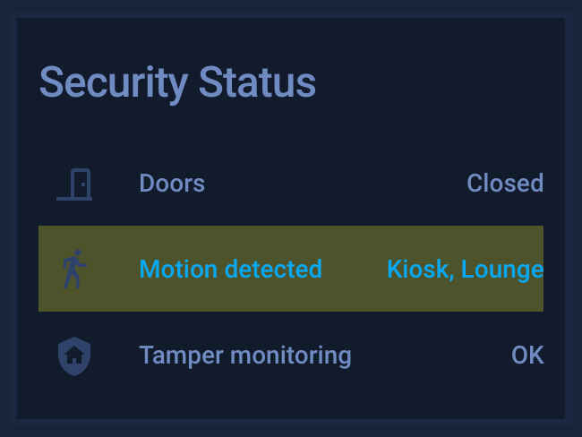
            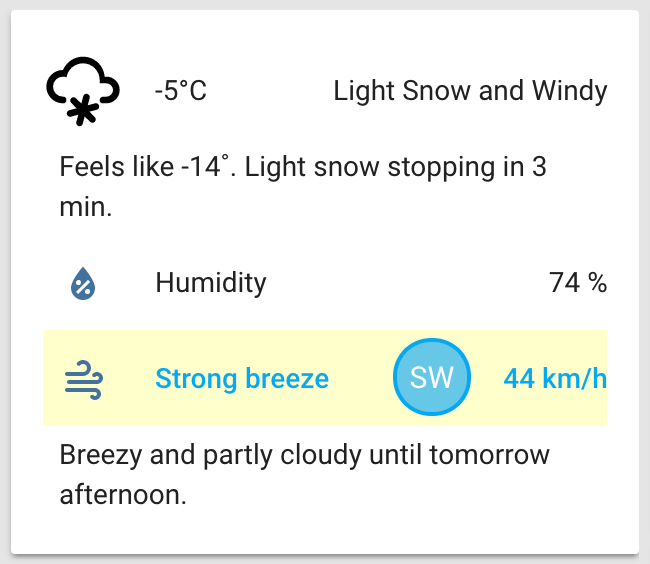
            
            
            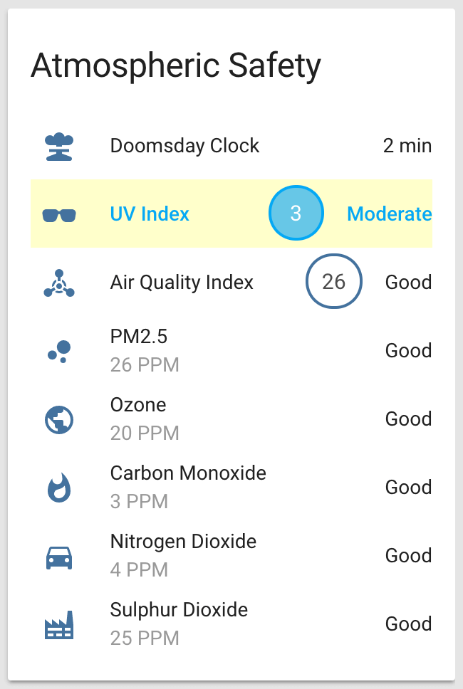
            
            
            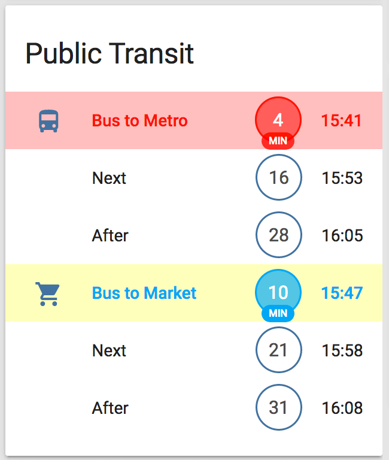
        

        <figcaption>
            
<strong>Sensor <a href="groups"><code>/groups/</code></a>.</strong>

        </figcaption>
    </figure>

## Contents

1. **[TL;DR](#tldr)**
1. **[Overview](#overview)**  
    [Goals](#goals) | [Agile development](#agile-development)
1. **[Key features](#Goals)**  
    [Climate control](#climate-control) | [Weather report](#weather-report) | [Lighting control](#lighting-control) | [Presence and basic security](#presence-and-basic-security) | [Modes and scenes](#modes-and-scenes) | [General information](#general-information) | [Additional human interfaces](#additional-human-interfaces)
1. **[Setup](#setup)**  
    [Diagram](#diagram) | [Supporting hardware choices](#supporting-hardware-choices) | 
    [Configuration](#configuration) | [System and interfaces](#system-and-interfaces) | [Physical devices](#physical-devices) | [Software](#software)
1. **[Thanks](#thanks)**

## TL;DR

This is a fully documented working configuration for Home Assistant, with screenshots, hints and comments. [Browse the code](#) to have a look!

## Overview

### Goals
- **Inconspicuous**: I like tech alright, but like any good butlers it should stay out of sight yet stay summonable. Think Fiji villa, not server room.
- **Modular**: Both code and devices should be easily replaceable.
- **Internet independent**: As much local processing as possible for the essential features.
- **Accessible through multiple ways:** Computers, tablet (kiosk), voice, smart phones, wireless buttons.
- **Intuitive user interfaces:** One look at a group of sensors/switches should be sufficient for anyone to understand the current states and how to operate an interface.
- **Redundant controls:** Multiple interfaces should be able to control devices without interference. State changes from manual interventions or dedicated manufacturer apps should be tracked whenever possible.
- **No information overload:** Provide just enough insights to get an idea of what's going on. And no need for data that's best consumed on more interactive devices (like stock prices, Steam community status...)
- **Not everything should be networked:** Bathroom fan, pantry and laundry room lights have their independent motion sensors and that's a good thing. Same independence goes for the smoke detector: I sure don't want to require extensive skin grafts because I forgot an extra space in a YAML file. _Yikes!_
- **No Alexa/Cortana/Google Voice:** I don't want to have advertising agencies, online stores, or other AI-feeding Big Brother tech-monsters listening in to everything we say _and do_ just for the dubious convenience of switching lights on by voice command. There are offline solutions that are privacy-counscious.

    <figure>
        

            
        

        <figcaption>
            
<strong>No thanks!</strong>

        </figcaption>
    </figure>

### Agile development

This configuration is built with an [Agile](http://agilemanifesto.org/)-like methodology, lead by following main user stories:

- **As a resident** I want a reliable home automation platform to handle lights and climate that can easily be controlled and overridden in many intuitive ways.
- **As an apartment dweller** I want to have a discrete, non-permanent installation that takes as little space as possible.
- **As a developer** I want to use an open-source platform that is feature-rich, accessible, flexible and actively maintained.
- **As a consumer** I want to pick and choose which devices I wish to acquire without necessarily being locked into a closed ecosystem.
- **As a couple** we want to be able to operate lights and climate-control appliances as well as get quick overview of weather forecasts and public transit schedules through simple to use interfaces.

Tasks are defined in the [issue queue][link-issues] and the development progress is managed using a [lightweight Kanban board][link-board].

    <figure>
        

            
        

        <figcaption>
            
<strong><a href="https://www.youtube.com/watch?v=wujVMIYzYXg" title="Princess Bride clip">Well, without the sprints. And a team. And the retrospectives. And the...</a></strong>

        </figcaption>
    </figure>

## Key features

### Climate control
- **Temperature monitoring**, averaged and rounded to compensate for sensor calibration issues.
- **Humidity monitoring**, also averaged and rounded.
- **Toggle dehumidifier when needed**, based on humidity averaged from multiple sensors, and only during the afternoon so not to bother anyone.
- **Turn dehumidifier off when windows/doors are opened**, instantly for windows and after a few minutes for doors.
- **Low/High humidity status and alerts**, in case something is wrong with the dehumidifier or the humidifier.
- **Mold conditions status and alert**, in case dehumidifier is full/overwhelmed or someone transformed the place into a steam room.

    <figure>
        

            
            
        

        <figcaption>
            
<strong>Climate control.</strong>

        </figcaption>
    </figure>

### Weather report
- **Easy to read status and forecasts** using [Dark Sky](https://darksky.net/) data and only showcasing parameters that actually matter, shown in obvious ways.
- **Outdoor quality monitoring** with numeric levels and human-friendly categorization for ozone, carbon monoxide, nitrogen dioxide, sulphur dioxide, 2.5μm particulate matter and UV light, averaged from multiple surrounding public local stations.
- **Weather radar and satellite maps** for [local rain and snow](https://weather.gc.ca/radar/index_e.html) from Environment Canada and [regional air masses](http://www.nhc.noaa.gov/satellite.php) from the U.S. National Oceanic and Atmospheric Administration.
- See [`/groups/`](groups) and [`/appdaemon/dashboards/`](appdaemon/dashboards).

    <figure>
        

            
            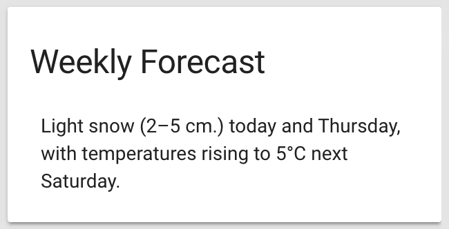
        

        <figcaption>
            
<strong>Today's weather and weekly forecast.</strong>

        </figcaption>
    </figure>

### Lighting control
- **Control for all pluggable lights**, smart ones at [`/lights/`](lights) and basic ones using [`/switches/`](switches).
- **Nanoleaf Aurora control**:
    + Manual theme selection.
    + Automatically rotate through device-based themes based on time of day (unless manually selected above).
- **LIFX Z bed underglow lights and ceiling wash lights control**:
    + Manual theme selection.
    + Automatically rotate through cloud-based themes based on time of day (unless manually selected above).
- **Automatically correlated color temperature (CCT)**, for [f.lux](https://justgetflux.com/)-like white temperature shift to gradually remove blue light based on a custom color and brightness curve, not simply based on the sun ...otherwise Canadian winters would be quite yellow!
- **Motion-based nightlights**, where strategic lights fade in, dimmed very low, when movement is detected at night, say when someone wakes up to go the bathroom ...again.
- See [`/lights/`](lights) and [`/automations/`](automations).

    <figure>
        

            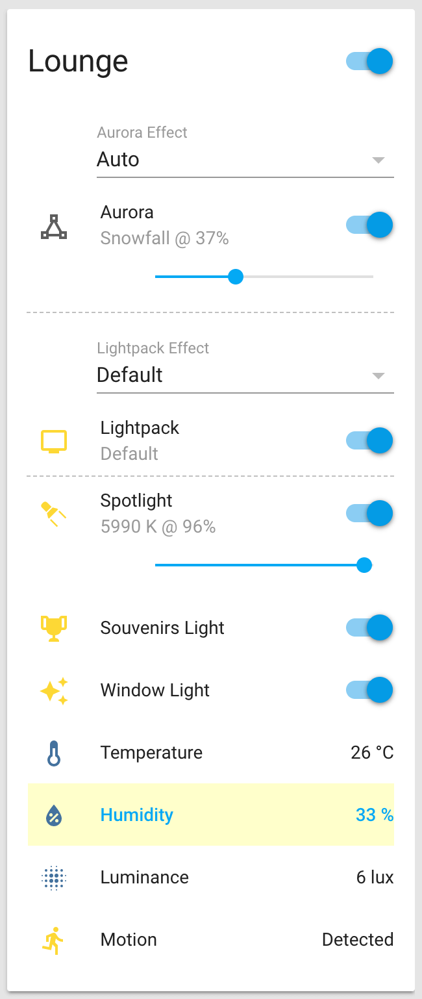
            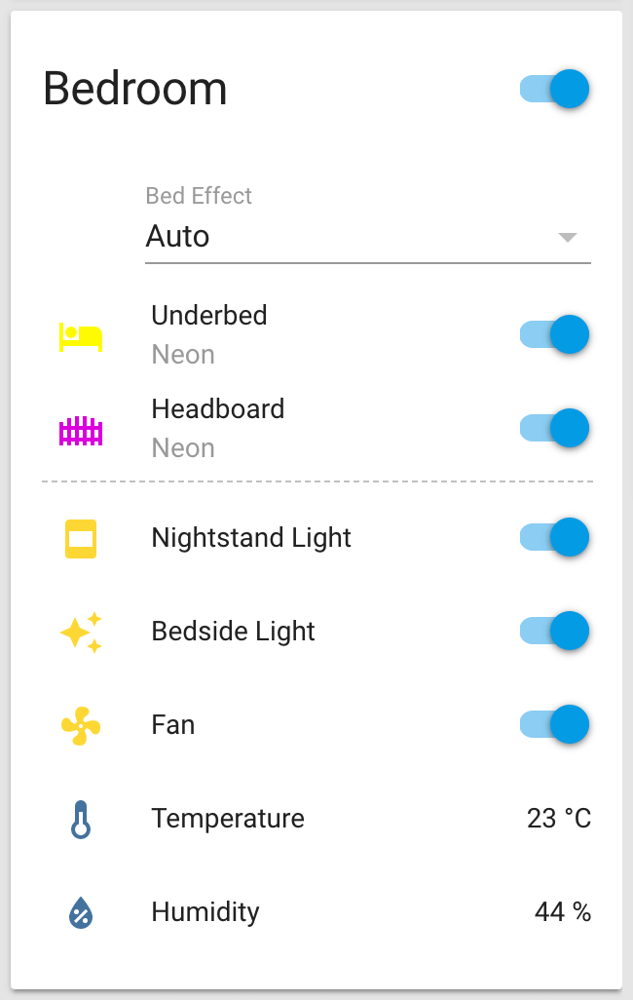
        

        <figcaption>
            
<strong>Lighting controls.</strong>

        </figcaption>
    </figure>

### Presence and basic security
- **Cellphone device sensing**, to check who is currently home or away.
- **Tamper monitoring**, in case a perimeter device has been played with.
- **Opened door alert**, to know if someone left an exteral door open.
- **Opened door indicators** where a chime is played and a few lights change color briefly and subtly when the front door opens/closes, say to indicate an oblivious  showering partner that their better half has left or just came in.

    <figure>
        

            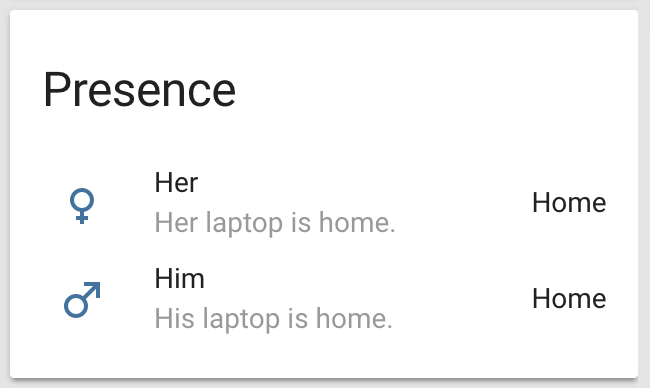
            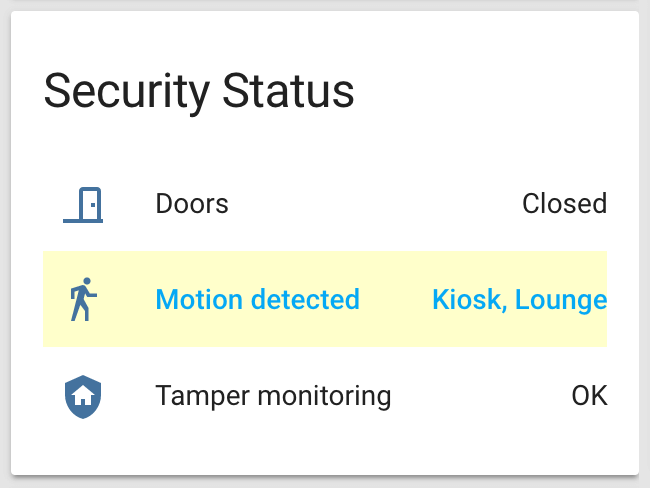
        

        <figcaption>
            
<strong>Presence and basic security.</strong>

        </figcaption>
    </figure>

### Modes and scenes
- **Mode based** where unless a blocking mode is set, devices will turn on. Think of a river or a horse: tame it to keep it under control, but release the restraints and they will do their thing: 🐎
    + **Quiet mode** where noise makers know to stop or not to start.
    + **Nap time mode** that fades out lights in and near the bedroom and enables quiet mode.
    + **Night mode** fades out all lights outside of bedroom, enabling quiet mode too.
    + **Low-power mode** where each room knows which device should be on or off to achieve a more economical and calm state.
- **Smart rooms** that know which devices should be on or off based on the modes above. No need for heavy centralized control, let local managers handle their teams!
- **Good morning action** that releases all blocking modes, allowing all lights to turn on gradually, and noise-making devices are allowed to run if needed.
- **Smart global scenes** based on [`/scripts/`](scripts)` instead of scenes, to allow for sequences and conditions:
    + **Movie scene** turns on ambiance lighting and dims smart lights when playing a movie, then returns to standard automations when pausing/stopping.
    + **Daylight, Gaming and Romantic global scenes** fades in and out different lights, sets effects and changes light colors to set a perfect mood.

    <figure>
        

            
        

        <figcaption>
            
<strong>Modes and scenes.</strong>

        </figcaption>
    </figure>

### General information
- **[Local bus schedules](https://home-assistant.io/components/sensor.gtfs/)** with the next 3 departures. See [`/gtfs/`](gtfs) for optimization hints.
- **[Doomsday Clock](https://github.com/renemarc/home-assistant-custom-components)** in case egocentric psychopaths keep on playing Russian roulette with humanity's future. 
- **Network status monitoring** for latency, upspeed, downspeed.
- **Home Assistant status monitoring** for geek cred with average load, RAM use, disk use, uptime, and update availability. 🤓

    <figure>
        

            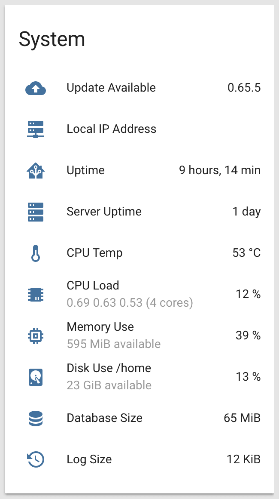
            
        

        <figcaption>
            
<strong>General information.</strong>

        </figcaption>
    </figure>

### Additional human interfaces
- **Flic buttons** on nightstand and in the kitchen for triggering modes and controlling localized lights, depending on current states and click types.
- **Aeotec Minimote** to quickly control global scenes and modes.
- **[Homebridge](https://github.com/nfarina/homebridge)** for using some key sensors and devices with iPhones.
- **[Home Assistant Companion](https://itunes.apple.com/us/app/home-assistant-companion/id1099568401?mt=8) iPhone app** for full UI access in the palm of my hand. _Muahahaha!_
- **[HADashboard](https://home-assistant.io/docs/ecosystem/hadashboard/)** for wall-mounted tablet, featuring indoor sensors reports, transit schedules, weather forecast and radar/sattelite maps, wrapped in an obvious navigation scheme for much UX goodness. Have a look at [`/appdaemon/dashboards/`](appdaemon/dashboards), you'll like! 😍

## Setup

### Diagram

    <figure>
        

            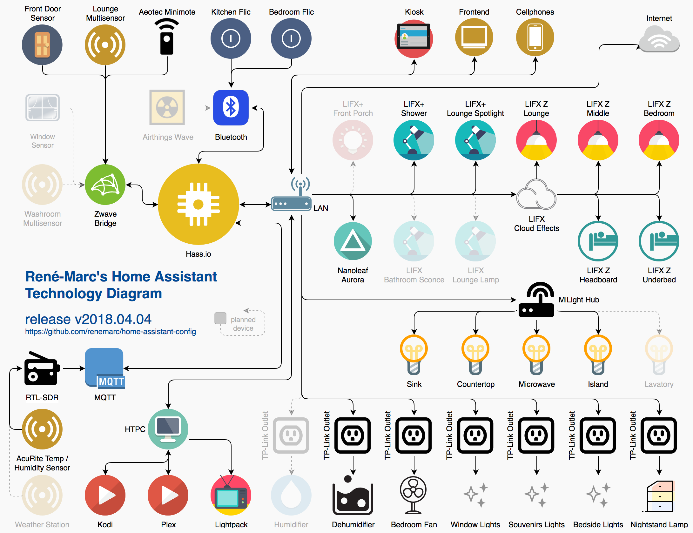
        

        <figcaption>
            
<strong>Technology Diagram (<a href="www/images/technology-diagram.png">PNG</a>, <a href="www/images/technology-diagram.svg">SVG</a>). Made with <a href="https://www.draw.io">Draw.io</a> (<a href="www/images/technology-diagram.xml">XML</a> source file).</strong>

        </figcaption>
    </figure>

### Supporting hardware choices
- **Ubiquiti router and access point** because forking over some dough for reliable, rock-solid prosumer networking gear makes everything run smoothly. And because hearing one less complaint (dropped wifi signal) from the girlfriend is priceless. \*sigh\*
- **Uninterruptible power supply** to ride over transient power failures.
- **Z-Wave** for reliability and guaranteed interoperability between vendors (unlike Zigbee...)
- **Wifi** for its cheapness, omnipresence and non requirement of vendor-specific hubs.

### Configuration
- **Dedicated, firewalled VLAN** (Virtual LAN) to segregate all IoT devices from other equipment ...because I cannot trust that my vacuum cleaner won't go on a killing spree. Ever seen [_Runaway (1984)_](https://www.youtube.com/watch?v=zCZY9Z6WvSY) with Tom Selleck? Eek! 😱
- **Local static IPs** for all devices to minimize random drops.
- **Local development** on a local virtual machine using Docker, then pulled with GIT on a Raspberry Pi.
- **Shareable code** with all identifiers kept in a non-committed, _secrets_ file.
- **Loads of documentation**, for my later self and to help out others.

### System and interfaces
- **[Raspberry Pi 3 Model B](https://www.raspberrypi.org/products/raspberry-pi-3-model-b/)** running Hass.io.
- **[Aeotec Z-Stick Gen5](https://aeotec.com/z-wave-usb-stick)** Z-Wave USB dongle.
- **[NooElec NESDR SMArt](http://www.nooelec.com/store/nesdr-smart.html)** RTL-SDR (software-defined radio) USB dongle for reading AcuRite sensors.
- **[Milight iBox2 Wifi Bridge](https://www.futlight.com/productdetails.aspx?id=239&typeid=125)** for kitchen RF LED strip controllers, using [LimitlessLED](https://home-assistant.io/components/light.limitlessled/) integration.

### Physical devices

#### Lights
- **[Nanoleaf Aurora](https://nanoleaf.me)** light panels kit. Pretty!
- **[LIFX+](https://www.lifx.com/products/lifx-plus)** A19 RGB light bulb (x2).
- **[LIFX Z](https://www.lifx.com/products/lifx-z-starter-kit-without-homekit)** light strip without HomeKit as bed underglow (x2) and ceiling wash lights (x3).
- **[Milight CCT LED RF Controller](https://www.futlight.com/productdetails.aspx?id=293&typeid=146)** for white-adjustable undercabinet kitchen lights (x4), connected to appropriate UL-listed power supplies.
- **[24V 3014 Warm White Cool White LED Strip](http://ledmontreal.com/en/led-strips-without-accessories/24v-led-strips-without-accessories/cct-adjustable-led-strip.html)** encased in custom cut and assembled [light-diffusing aluminum profiles](http://ledmontreal.com/en/led-bars-and-profiles-led-montreal/continuous-lighting-aluminum-profile.html), connected to above RF controllers.
- **[Adalight](https://learn.adafruit.com/adalight-diy-ambient-tv-lighting)** DIY 100-dots TV backlighting controlled by [Lightpack+Prismatik](https://github.com/psieg/Lightpack) on HTPC.
- **Fairy lights** via TP-Link wifi outlets (x3).
- **DIY LED nightstand** via TP-Link wifi outlet.

#### Sensors
- **[Aeotec Door / Window Sensor Gen5](https://aeotec.com/z-wave-door-window-sensor)** for front door.
- **[Aeotec MultiSensor 6](https://aeotec.com/z-wave-sensor)** for temperature/humidity/presence detection.
- **[AcuRite 06044M Wireless Sensor](https://www.acurite.com/indoor-temperature-sensor-and-humidity-gauge.html)** for cheap temperature and humidity monitoring.

#### Human Interfaces
- **[Acer Iconia One 10" tablet](https://www.acer.com/ac/en/CA/content/series/iconiaone10)** (1280x800 IPS screen) wallmounted as a kiosk. See [`/appdaemon/dashboards/`](appdaemon/dashboards).
- **[Aeotec Minimote](https://www.youtube.com/watch?v=5Vc1Ift7ND8)** Z-Wave remote control.
- **[Flic](https://flic.io)** bluetooth low energy buttons.

#### Switches and other devices
- **[TP-Link Smart Wi-Fi Plug Mini outlets](http://www.tp-link.com/us/products/details/cat-5516_HS105.html)** to control dumb devices (x6).
- **[Frigidaire dehumidifier](http://www.dehumidifierbuyersguide.com/frigidaire-ffad7033r1-review)** via TP-Link wifi outlet.
- **Oscillating fan** via TP-Link wifi outlet.

### Software
- **[Hass.io](https://home-assistant.io)** on Raspberry Pi (production setup).
- **[Docker](https://www.docker.com)** on local machine (for development). True, Hass.io is Docker-based too... 😉
- **[Fully Kiosk Browser](https://www.ozerov.de/fully-kiosk-browser/)** on wallmounted tablet for display and input.
- **[LANnouncer](http://www.keybounce.com/lannouncer/)** on wallmounted tablet for simple audio and text-to-speech messaging.

#### Hass.io add-ons
- **[AppDaemon](https://github.com/home-assistant/appdaemon)** for HADashboard tablet UI.
- **[Bluetooth BCM43xx](https://home-assistant.io/addons/bluetooth_bcm43xx)** to use Raspberry Pi's bluetooth.
- **[Flicd](https://github.com/pschmitt/hassio-addons)** to connect with Flic bluetooth buttons.
- **[Homebridge](https://github.com/hassio-addons/addon-homebridge)** to control non-HomeKit compatible devices using iPhones.
- **[Mosquitto MQTT broker](https://home-assistant.io/addons/mosquitto)** for standard IoT messaging.
- **[RTL_433 to MQTT Bridge](https://github.com/james-fry/hassio-addons)** to receive and decode AcuRite radio signals.
- **[Samba share](https://home-assistant.io/addons/samba)** for configuration file sharing.
- **[SSH server](https://home-assistant.io/addons/ssh)** for command-line access.

#### Community components and widgets
- **[Custom UI elements](https://github.com/andrey-git/home-assistant-custom-ui)** to improve the display of sensors and jazz up the interface a bit.
- **[Display](https://github.com/daemondazz/homeassistant-displays)** platform for integration with the Fully Kiosk Browser..
- **[Horizontal line state card](https://github.com/covrig/homeassistant-hline)** to visually separate long lists of sensors.
- **[Lightpack](https://github.com/kklemm91/Lightpack-HASS)** component.
- **[Text-only state card](https://community.home-assistant.io/t/display-only-text-in-card/20536/26)** for wordy sensor states.
- **[Variable](https://github.com/rogro82/hass-variables)** component for non-boolean values.

## Thanks

Kudos to:
- **The [dedicated core team](https://home-assistant.io/blog)** that builds and manages Home Assistant. They work fast and humbly.
- **The horde of volunteer developers** of all components and add-ons.
- **The [vibrant community](https://community.home-assistant.io)**, always willing to help and share code samples.
- **The [BRUH Automation](https://www.youtube.com/c/bruhautomation1) YouTube channel**, Ben's videos got me hooked on using Home Assistant.

Thank you for all your dedication, helpfulness and valuable insights. Cheers! 🍻😃

<!--
Image references.
-->

[img-travis-ci]:https://img.shields.io/travis/renemarc/home-assistant-config.svg?branch=master&logo=travis
[img-github-release]:https://img.shields.io/github/release/renemarc/home-assistant-config/all.svg
[img-repo-size]:https://img.shields.io/github/repo-size/renemarc/home-assistant-config.svg
[img-code-size]:https://img.shields.io/github/languages/code-size/renemarc/home-assistant-config.svg
[img-ha-version]:https://img.shields.io/badge/tested_on_Home_Assistant-0.69-53c1f1.svg
[img-hassio]:https://img.shields.io/badge/config_for-Hass.io-53c1f1.svg
[img-license]:https://img.shields.io/github/license/renemarc/home-assistant-config.svg

<!--
Link references.
-->

[link-repo]:https://github.com/renemarc/home-assistant-config
[link-issues]:https://github.com/renemarc/home-assistant-config/issues
[link-board]:https://github.com/renemarc/home-assistant-config/projects/1
[link-travis-ci]:https://travis-ci.org/renemarc/home-assistant-config
[link-hassio]:https://home-assistant.io/hassio/
[link-ha-version]:https://www.home-assistant.io/blog/2018/05/11/release-69/
[link-license]:LICENSE.txt
