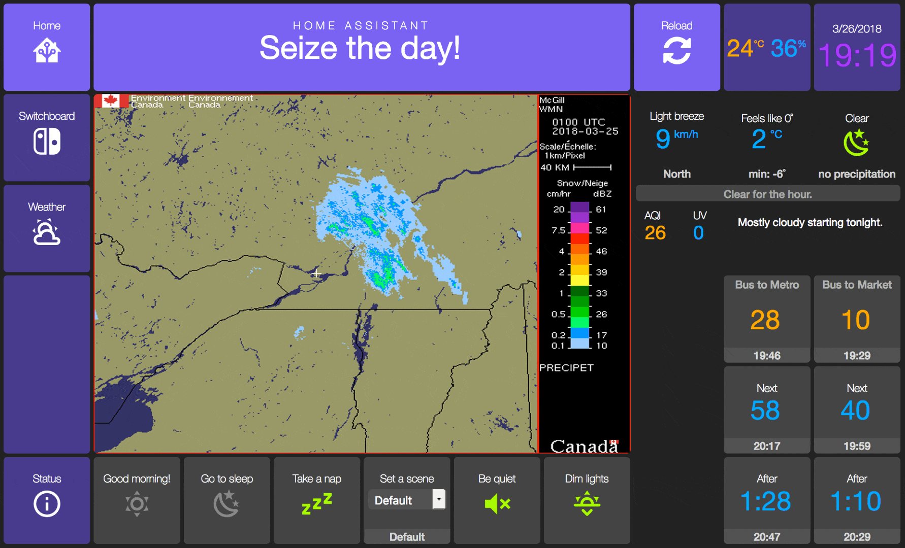

<!-- Header -->
[link-profile]:https://github.com/renemarc
[link-repo]:https://github.com/renemarc/home-assistant-config

<code>[renemarc][link-profile] / **[home-assistant-config][link-repo]** / **appdaemon** /</code>

<strong><a href="https://github.com/renemarc/home-assistant-config">🏠 Home Assistant configuration for a smart-looking place! 😎</a> Be sure to <a href="#" title="star">⭐️</a> this repo!</strong>

<!-- Hero -->
<figure>
    

        
    

</figure>

<h1 align="center">AppDaemon configuration</h1>

## Folders

### [`📂 ./apps/`](apps)

Empty, to be used for eventual AppDaemon apps.

### [`🌈 ./custom_css/`](custom_css/modern)

For the **Modern** theme.

### [`🔘 ./custom_widgets/`](custom_widgets)

For third-party, custom and modified dashboard widgets.

### [`🖼 ./dashboards/`](dashboards)

For the dashboards used in HADashboard.

<a href="#top" title="Back to top">🔝</a>

## Files

### [`⚙️ ./appdaemon.yaml`](appdaemon.yaml)

AppDaemon configuration file.

### [`🔑 ./secrets-dummy.yaml`](secrets-dummy.yaml)

Placeholder file for sensitive information, to be copied to `secrets.yaml` and modified according to the target environment.

<!-- Footer -->

<a href="#top" title="Back to top">🔝</a>

<strong>Don't forget to <a href="#" title="star">⭐️</a> this repo! 😃</strong>

[🏠 Home][link-repo]
