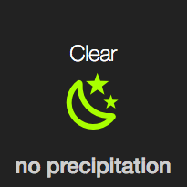
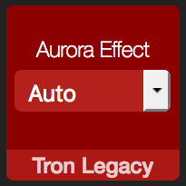
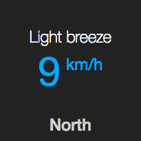
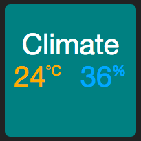

<!-- Header -->
[link-profile]:https://github.com/renemarc
[link-repo]:https://github.com/renemarc/home-assistant-config

<code>[renemarc][link-profile] / **[home-assistant-config][link-repo]** / [appdaemon](..) / **custom_widgets** /</code>

<strong><a href="https://github.com/renemarc/home-assistant-config">🏠 Home Assistant configuration for a smart-looking place! 😎</a> Be sure to <a href="#" title="star">⭐️</a> or <a href="#" title="fork">🔱</a> this repo!</strong>

<!-- Hero -->
<figure>
    

        
    

    

        
        
        
        
    

</figure>

<h1 align="center">Custom AppDaemon widgets</h1>

[AppDaemon](https://www.home-assistant.io/docs/ecosystem/appdaemon/) offers [many default widgets](https://github.com/home-assistant/appdaemon/tree/master/appdaemon/widgets/), but can also support third-party and custom ones.

## Community widgets

### [`💡 iconsensor.yaml`](iconsensor.yaml) and [`baseiconsensor`](baseiconsensor)

Icon widget from [ReneTode's repo](https://github.com/ReneTode/My-AppDaemon/tree/master/custom_widgets/baseiconsensor), modified with:

- Added support for entities used as **title** and **title2**.

    <figure>
        

            
        

        <figcaption>
            
<strong>Icon sensor widget with title2 entity.</strong>

        </figcaption>
    </figure>

<a href="#top" title="Back to top">🔝</a>

### [`🔘 input_select.yaml`](input_select.yaml) and [`baseselect/`](baseselect)

Selector widget also from [ReneTode's repo](https://github.com/ReneTode/My-AppDaemon/tree/master/custom_widgets/baseselect), modified with:

- Added support for **sub_entities**.

    <figure>
        

            
        

        <figcaption>
            
<strong>Input select widget with sub entity.</strong>

        </figcaption>
    </figure>

<a href="#top" title="Back to top">🔝</a>

## Custom widgets

### [`👽 entitysensor.yaml`](entitysensor.yaml) and [`baseentitydisplay/`](baseentitydisplay)

Multipurpose widget based on the default [basedisplay](https://github.com/home-assistant/appdaemon/tree/master/appdaemon/widgets/basedisplay) but with the following modifications:

- Support for entities used as **title** and **title2**.
- Include **unit_of_measurement** to the **sub_entity**, if any.

    <figure>
        

            
        

        <figcaption>
            
<strong>Entity sensor widget with title2 entity.</strong>

        </figcaption>
    </figure>

<a href="#top" title="Back to top">🔝</a>

### [`📽️ slideshow.yaml`](slideshow.yaml) and [`baseslideshow/`](baseslideshow)

Camera/image/iframe widget to showcase images and slideshows, based on the default [basecamera](https://github.com/home-assistant/appdaemon/tree/master/appdaemon/widgets/basecamera) and [baseiframe](https://github.com/home-assistant/appdaemon/tree/master/appdaemon/widgets/baseiframe) but also includes:

- Support for camera entities with proper handling of their access tokens.
- Auto-determine type of content: entity, iframe, or image.
- Auto-determine camera URL base.
- Cache-buster added to already parameterized URLs.
- Optional **cache** integer parameter to add longevity to the cache-buster JS parameter.
- Optional entity dynamic titles, where an image can have a related title shown if it has a companion entity that provides such textual information.
- Per slide title, cache, and delay overrides.

    <figure>
        

            
        

        <figcaption>
            
<strong>Slideshow widget with dynamic titles.</strong>

        </figcaption>
    </figure>

<a href="#top" title="Back to top">🔝</a>

### [`📶 multisensor.yaml`](multisensor.yaml) and [`basemultisensor/`](basemultisensor)

Multi-sensors widget, like the **entitysensor** above, but adds:

- List two sensors side by side (useful to showcase both _temperature_ and _humidity_ together).

    <figure>
        

            
        

        <figcaption>
            
<strong>Multisensor widget with temperature and humidity.</strong>

        </figcaption>
    </figure>

<a href="#top" title="Back to top">🔝</a>

## Customization

The extra styling of these widgets is done in the theme [`/appdaemon/custom_css/modern/`](../custom_css/modern) as well as directly in [`/appdaemon/dashboards/`](../dashboards).

<!-- Footer -->

<a href="#top" title="Back to top">🔝</a>

<strong>Don't forget to <a href="#" title="star">⭐️</a> or <a href="#" title="fork">🔱</a> this repo! 😃</strong>

[🔙 Back to `/appdaemon/`](../)

[🏠 Home][link-repo]
