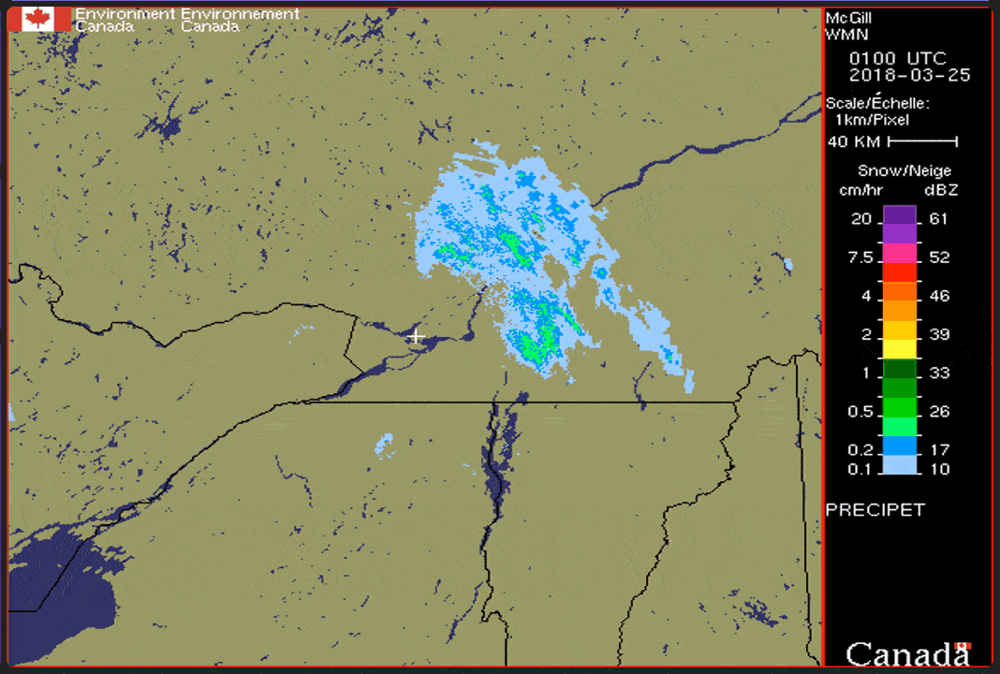

# Custom AppDaemon widgets

[AppDaemon](https://home-assistant.io/docs/ecosystem/appdaemon/) offers [many default widgets](https://github.com/home-assistant/appdaemon/tree/master/appdaemon/widgets/), but can also support third-party and custom ones.

## Community widgets

### [`💡 iconsensor.yaml`](iconsensor.yaml) and [`baseiconsensor`](baseiconsensor)

Icon widget from [ReneTode's repo](https://github.com/ReneTode/My-AppDaemon/tree/master/custom_widgets/baseiconsensor), modified with:
- Added support for entities used as **title** and **title2**.

    <figure>
        

            
        

        <figcaption>
            
<strong>Icon sensor widget with title2 entity.</strong>

        </figcaption>
    </figure>

### [`🔘 input_select.yaml`](input_select.yaml) and [`baseselect`](baseselect)

Selector widget also from [ReneTode's repo](https://github.com/ReneTode/My-AppDaemon/tree/master/custom_widgets/baseselect), modified with:
- Added support for **sub_entities**.

    <figure>
        

            
        

        <figcaption>
            
<strong>Input select widget with sub entity.</strong>

        </figcaption>
    </figure>

## Custom widgets

### [`👽 entitysensor.yaml`](entitysensor.yaml) and [`baseentitydisplay`](baseentitydisplay)

Multipurpose widget based on the default [basedisplay](https://github.com/home-assistant/appdaemon/tree/master/appdaemon/widgets/basedisplay) but with the following modifications:
- Support for entities used as **title** and **title2**.
- Include **unit_of_measurement** to the **sub_entity**, if any.

    <figure>
        

            
        

        <figcaption>
            
<strong>Entity sensor widget with title2 entity.</strong>

        </figcaption>
    </figure>

### [`📸 entitycamera.yaml`](entitycamera.yaml) and [`baseentityiframe`](baseentityiframe)

IFrame widget to showcase images and slideshows, based on the default [baseiframe](https://github.com/home-assistant/appdaemon/tree/master/appdaemon/widgets/baseiframe) but includes:
- Cache-buster added to already parameterized URLs.
- Optional **cache** integer parameter to add longevity to the cache-buster JS parameter.
- Optional entity dynamic titles, where an image can have a related title shown if it has a companion entity that provides such textual information.

    <figure>
        

            
        

        <figcaption>
            
<strong>Entity camera widget with dynamic titles.</strong>

        </figcaption>
    </figure>

###  [`📶 multisensor.yaml`](multisensor.yaml) and [`basemultisensor`](basemultisensor)
Multi-sensors widget, like the **entitysensor** above, but adds:
- List two sensors size by side (useful to showcase both _temperature_ and _humidity_ together). 

    <figure>
        

            
        

        <figcaption>
            
<strong>Multisensor widget with temperature and humidity.</strong>

        </figcaption>
    </figure>

## Customization

The extra styling of these widgets is done in the theme [`/appdaemon/custom_css/modern/`](../custom_css/modern) as well as directly in [`/appdaemon/dashboards/`](../dashboards).
