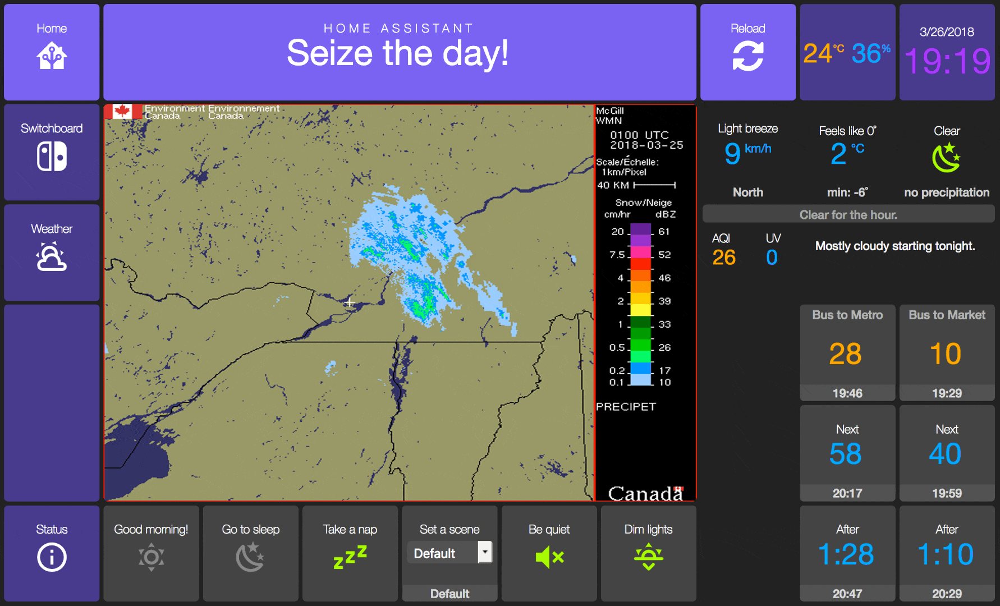
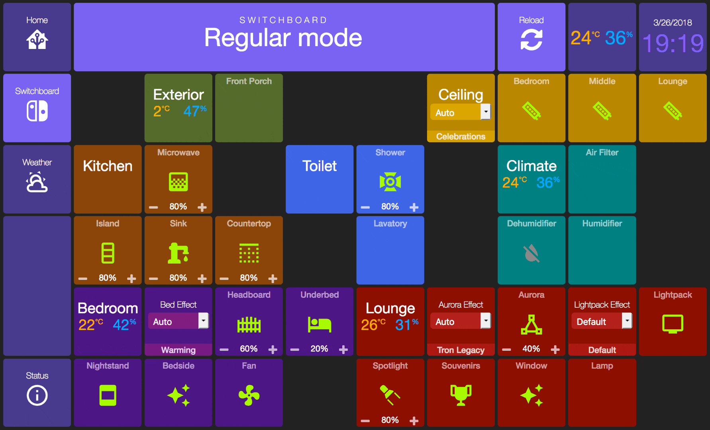
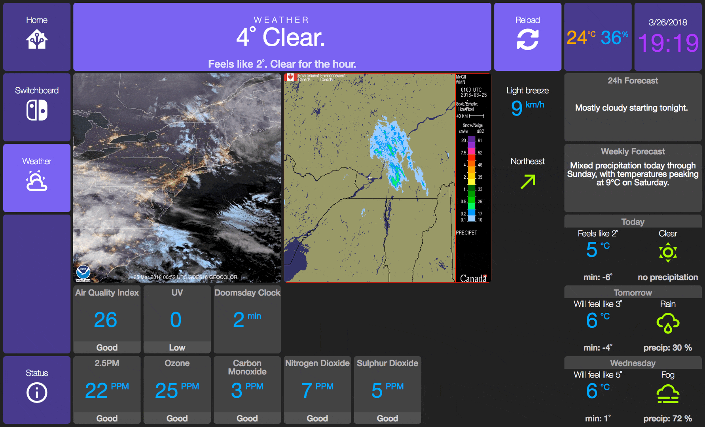
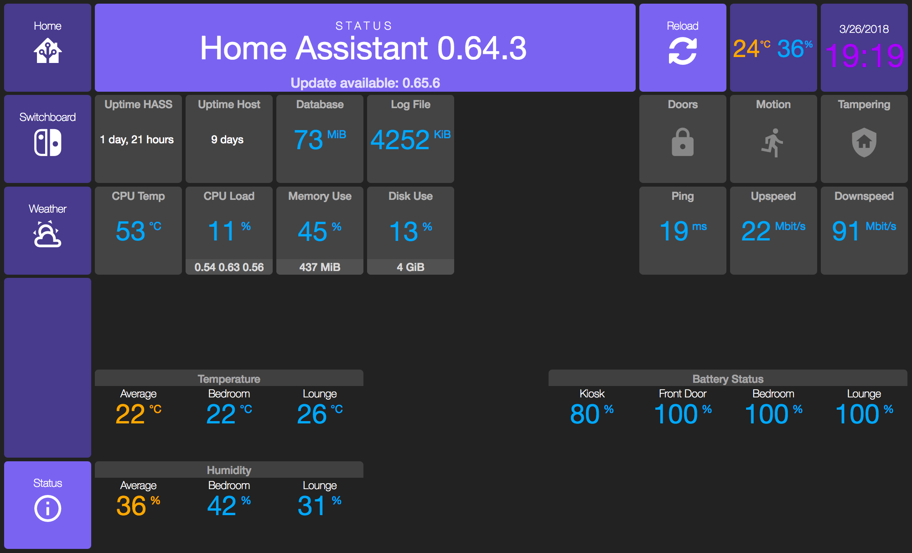

<!-- Header -->
[link-profile]:https://github.com/renemarc
[link-repo]:https://github.com/renemarc/home-assistant-config

<code>[renemarc][link-profile] / **[home-assistant-config][link-repo]** / [appdaemon](..) / **dashboards** /</code>

<strong><a href="https://github.com/renemarc/home-assistant-config">🏠 Home Assistant configuration for a smart-looking place! 😎</a> Be sure to <a href="#" title="star">⭐️</a> or <a href="#" title="fork">🔱</a> this repo!</strong>

<!-- Hero -->
<figure>
    

        
        
        
        
    

</figure>

<h1 align="center">AppDaemon dashboards</h1>

These are dashboards to be used in a wall-mounted tablet to control Home Assistant the same way you would on a computer, only in a more appropriate interface for casual and often-on display.

Most implementations of AppDaemon/HADashboard focus on having a car-like in-dash interface and overloading the screen with tons of sensors. That leads to a poor user experience in my opinion.

When using a large-enough format tablet, I prefer intuitive interfaces like the ones you are familiar with on fixed-width websites. Intuitive navigation, just enough data to feel at ease without being overwhelmed. And it must be pretty-enough to be hung on a wall ...literally!

These dashboards target a 10" display tablet with 1024x800 resolution using a full-screen browser. In my case I use Adroid and the [Fully Kiosk Browser](http://www.ozerov.de/fully-kiosk-browser/) with the status-bar active on a white [Acer Iconia One](https://www.acer.com/ac/en/CA/content/series/iconiaone10). It's great for this usage: it has an IPS display, is relatively inexpensive, looks good, has a responsive touchscreen, is snappy enough with its 2GB of RAM, is made to be held at the horizontal, and has a top-mounted front-camera for eventual screen wake-up on motion. I have it held in place using [Koala damage-free wall-mounts](https://www.dockem.com/category-s/1861.htm) in a central location, and it is permanently hooked to USB power.

<a href="#top" title="Back to top">🔝</a>

## Fixed elements

The top menu and left-hand navigation are fixed. The navigation colours change depending on which dashboard you're on and the top menu title changes accordingly. That makes navigation intuitive for anyone.

### [`📰 ./header.yaml`](header.yaml)

Contains fixed elements showing at the top of each dashboard.

<a href="#top" title="Back to top">🔝</a>

## Organization

Dashboards are split into 4 pages, organized in a similar fashion as [`/ui-lovelace.yaml/`](../../ui-lovelace.yaml) only with less administrative features and prettier colours.

### [`🏠 ./Main.dash`](Main.dash)

With a feel-good welcome message, common actions, quick weather status, bus schedules, and rotating set of weather radar, satellite map and pretty pictures of the day.

    <figure>
        

            
        

        <figcaption>
            <strong>Main dashboard.</strong>
        </figcaption>
    </figure>

<a href="#top" title="Back to top">🔝</a>

### [`🔘 ./Switchboard.dash`](Switchboard.dash)

Organized my room and control zone, including climate control. Looks kind of like Tetris! 😃

    <figure>
        

            
        

        <figcaption>
            <strong>Switchboard, with placeholders for planned devices.</strong>
        </figcaption>
    </figure>

<a href="#top" title="Back to top">🔝</a>

### [`🌦 ./Weather.dash`](Weather.dash)

With current conditions, forecasts, air quality, and rotating satellite images and animated radar maps.

    <figure>
        

            
        

        <figcaption>
            <strong>Weather dashboard.</strong>
        </figcaption>
    </figure>

<a href="#top" title="Back to top">🔝</a>

### [`👀 ./Status.dash`](Status.dash)

Geeky details about Home Assistant, network, battery status and per-location temperature and humidity.

    <figure>
        

            
        

        <figcaption>
            <strong>Status dashboard.</strong>
        </figcaption>
    </figure>

<a href="#top" title="Back to top">🔝</a>

## Theme

The [`/appdaemon/custom_css/modern/`](../custom_css/modern) theme is based on an adapted version of the default theme. Only some CSS rules differ, in addition to support for third-party and custom widgets.

The contents of many tiles depend on specific [template sensors](../../sensors) to make information easier to digest.

<!--
Footer starts.
-->

<a href="#top" title="Back to top">🔝</a>

<strong>Don't forget to <a href="#" title="star">⭐️</a> or <a href="#" title="fork">🔱</a> this repo! 😃</strong>

[🔙 Back to `/appdaemon/`](../)

[🏠 Home][link-repo]
<!--
Footer ends.
-->
