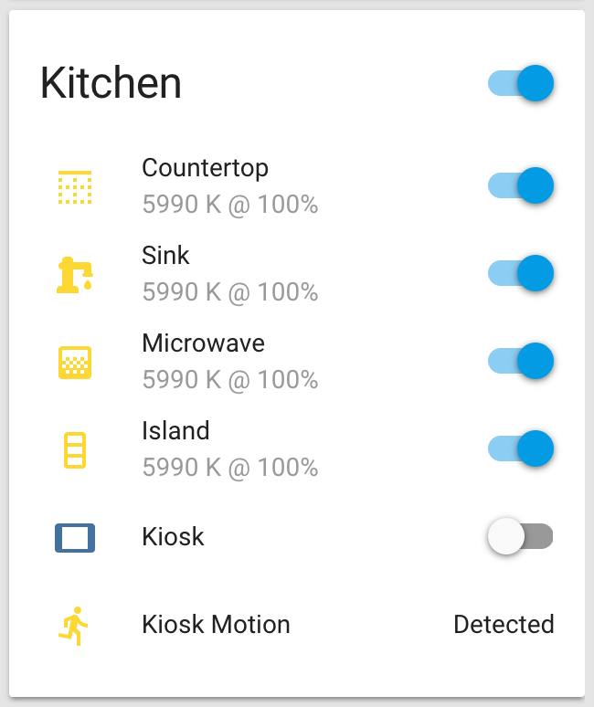
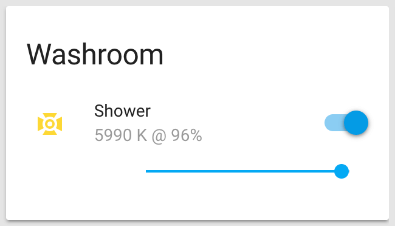

# Areas Automations

Areas represent _rooms_ (bedroom, kitchen, lounge, washroom) and _zones_ (open ceiling, exterior).

Most of these automations are subscribers for modes defined in [`/misc/input_booleans.yaml`](../misc/input_booleans.yaml) and managed through [`/automations/modes/`](../modes/).

Areas are smart enough to understand what to do when a higher-level order (mode) is given. They know which device within their control should be turned on, dimmed or turned off. Like with work teams, areas are the group leaders: indivual team members don't have to worry about making sense of management's desires and instead just follow their team leader's directives.

## Bedroom

    <figure>
        

            
        

        <figcaption>
            
<strong>Bedroom group.</strong>

        </figcaption>
    </figure>

### [`🔅️ ./bedroom_low.yaml`](bedroom_low.yaml)

Set bedroom to _low-power_ state.

Only set low-power state if not currently in _nap mode_.

### [`⏹️ ./bedroom_off.yaml`](bedroom_off.yaml)

Turn off bedroom.

Bedroom lights should be off when napping.

### [`▶️ ./bedroom_on.yaml`](bedroom_on.yaml)

Turn on bedroom.

If _low-power_ mode is enabled, the [`bedroom_low.yaml`](bedroom_low.yaml) automation will be used instead.

## Ceiling

Ceiling wash lights are three sets of [LIFX Z RGBW strips](https://www.lifx.com/products/lifx-z) (see [`/lights/`](../../lights#lifx-z-rgbw-led-strips)) set atop cabinets and partition walls, illuminating the ceiling without being directly visible.

    <figure>
        

            
        

        <figcaption>
            
<strong>Ceiling LIFX Z strip control.</strong>

        </figcaption>
    </figure>

### [`🌈 ./ceiling_effect.yaml`](ceiling_effect.yaml)

Change ceiling wash lights based on [LIFX Cloud scenes](https://home-assistant.io/components/scene.lifx_cloud/).

The LIFX strips have a few effects programmed with the LIFX mobile app and stored on their servers. Each effect mentions which device will receive which colour pattern. Also, each effect has a UUID that can be used to load the effect from the servers and program the LIFX devices accordingly.

### [`🔅️ ./ceiling_low.yaml`](ceiling_low.yaml)

Set ceiling wash lights to _low-power_ state.

Only set low-power state if not currently in nap or night modes. The end result is currently very close to [`ceiling_off.yaml`](ceiling_off.yaml) but this automation is kept separate to allow for any eventual evolution.

### [`⏹️️ ./ceiling_off.yaml`](ceiling_off.yaml)

Turn off ceiling wash lights.

Ceiling wash lights should be off when napping or sleeping.

### [`▶️️ ./ceiling_on.yaml`](ceiling_on.yaml)

Turn on ceiling wash lights.

### [`⏲️️ ./ceiling_schedule.yaml`](ceiling_schedule.yaml)

Schedule ceiling wash lights based on LIFX Cloud scenes.

Unless an effect is manually selected, this scheduler will do its thing.

### [`🔘 ./ceiling_select.yaml`](ceiling_select.yaml)

Manually select a LIFX cloud effect for the ceiling wash lights.

## Kitchen

    <figure>
        

            
        

        <figcaption>
            
<strong>Kitchen group.</strong>

        </figcaption>
    </figure>

### [`🍳 ./kitchen_low.yaml`](kitchen_low.yaml)

Set kitchen to _low-power_ state.

Only set low-power state if not currently in _nap_ or _night_ modes.

### [`🍳 ./kitchen_off.yaml`](kitchen_off.yaml)

Turn off kitchen.

Kitchen lights should be off when sleeping.

### [`🍳️ ./kitchen_on.yaml`](kitchen_on.yaml)

Turn on kitchen.

If _low-power mode_ is enabled, the [`kitchen_low.yaml`](kitchen_low.yaml) automation will be used instead.

## Lounge

    <figure>
        

            
        

        <figcaption>
            
<strong>Lounge group.</strong>

        </figcaption>
    </figure>

### [`🛋️ ./lounge_low.yaml`](lounge_low.yaml)

Set lounge to _low-power_ state.

Only set low-power state if not currently in nap to night modes.

### [`🛋️ ./lounge_off.yaml`](lounge_off.yaml)

Turn off lounge.

Lounge lights should be off when sleeping.

### [`🛋️ ./lounge_on.yaml`](lounge_on.yaml)

Turn on lounge.

If _low-power mode_ is enabled, the [`lounge_low.yaml`](lounge_low.yaml) automation will be used instead.

## Washroom

    <figure>
        

            
        

        <figcaption>
            
<strong>Washroom group.</strong>

        </figcaption>
    </figure>

### [`🚿 ./washroom_low.yaml`](washroom_low.yaml)

Set washroom to _low-power_ state.

Only set low-power state if not currently in nap to night modes. The end result is currently very close to [`washroom_off.yaml`](washroom_off.yaml) but this automation is kept separate to allow for any eventual evolution.

### [`🚿️ ./washroom_off.yaml`](washroom_off.yaml)

Turn off washroom.

Wahsroom lights should be off when napping or sleeping.

### [`🚿️ ./washroom_on.yaml`](washroom_on.yaml)

Turn on washroom.

If _low-power_ mode is enabled, the [`washroom_low.yaml`](washroom_low.yaml) automation will be used instead.

## Customization

The bulk of the customization is done in [`/customize.yaml`](../../customize.yaml) and [`/customize_glob.yaml`](../../customize_glob.yaml).

The looks of many state cards depend on Custom UI and other templates in [`/www/custom_ui/`](../../www/custom_ui).
