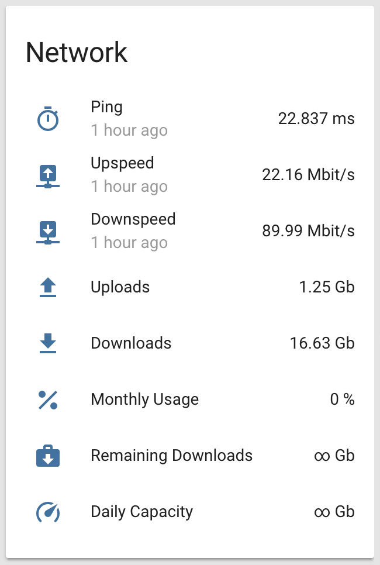
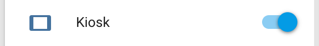
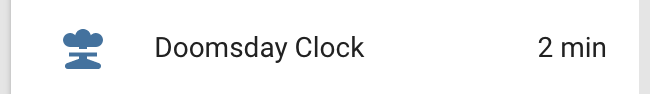

<!-- Header -->
[link-profile]:https://github.com/renemarc
[link-repo]:https://github.com/renemarc/home-assistant-config

<code>[renemarc][link-profile] / **[home-assistant-config][link-repo]** / **custom_components** /</code>

<strong><a href="https://github.com/renemarc/home-assistant-config">🏠 Home Assistant configuration for a smart-looking place! 😎</a> Be sure to <a href="#" title="star">⭐️</a> this repo!</strong>

<!-- Hero -->
<figure>
    

        
        
    

    

        
        
        
    

</figure>

<h1 align="center">Custom components, community contributions, and overrides</h1>

## Community components

### [`🎦 ./display/`](display)

Interact with Android devices running the [Fully Kiosk Browser](https://www.ozerov.de/fully-kiosk-browser) by using this third-party [Display platform](https://github.com/daemondazz/homeassistant-displays).

    <figure>
        

            
        

        <figcaption>
            
<strong>Kiosk control.</strong>

        </figcaption>
    </figure>

<a href="#top" title="Back to top">🔝</a>

### [`📺 ./light/lightpack.py`](light/lightpack.py)

Supports basic operation of [Prismatik](https://github.com/psieg/Lightpack) monitor bias lighting using this [Lightpack component](https://github.com/kklemm91/Lightpack-HASS).

    <figure>
        

            
        

        <figcaption>
            
<strong>Lightpack control.</strong>

        </figcaption>
    </figure>

<a href="#top" title="Back to top">🔝</a>

### [`💀 ./sensor/doomsday_clock.py`](sensor/doomsday_clock.py)

A local copy of my depressing [Doomsday Clock sensor](https://github.com/renemarc/home-assistant-doomsday-clock) that tracks the _Bulletin of the Atomic Scientists_' [world threat assessment index](https://thebulletin.org/doomsday-clock/) indicating how close humanity is to a man-made global catastrophe either through nuclear war or climate change.

    <figure>
        

            
        

        <figcaption>
            
<strong>Doomsday Clock.</strong>

        </figcaption>
    </figure>

<a href="#top" title="Back to top">🔝</a>

### [`❓ ./variable.py`](variables.py)

The missing link that allows storage of non-boolean values using the [Variable component](https://github.com/rogro82/hass-variables).

<a href="#top" title="Back to top">🔝</a>

## Overriden components

These are default Home Assistant components that were copied from the core to alter their behaviour. These changes really should be turned into appropriate [PRs](https://github.com/home-assistant/home-assistant/pulls).

### [`📡 ./sensor/ebox.py`](sensor/ebox.py)

[Ebox](https://github.com/home-assistant/home-assistant/blob/master/homeassistant/components/sensor/ebox.py) ISP data consumtion component:
- Upgraded [pyebox](https://github.com/titilambert/pyebox/) dependency to [support unlimited data packages](https://github.com/titilambert/pyebox/issues/1).

    <figure>
        

            
        

        <figcaption>
            
<strong>Network group.</strong>

        </figcaption>
    </figure>

<a href="#top" title="Back to top">🔝</a>

### [`🚌 ./sensor/gtfs.py`](sensor/gtfs.py)

[GTFS](https://github.com/home-assistant/home-assistant/blob/master/homeassistant/components/sensor/gtfs.py) public transit schedules component:
- Added support for next bus departures.
- Simplified query, making it cacheable in order to increase IO performance.
- Allow querying departures after midnight.
- Correctly set arrival date to tommorow when bus leaves before midnight but arrives after.
- Return **Null** instead of **Zero** when a departure is not found/available.

    <figure>
        

            
        

        <figcaption>
            
<strong>Public Transit group with schedules for the next three departures in two directions. Got to catch that bus! 🚌🏃</strong>

        </figcaption>
    </figure>

<!-- Footer -->

<a href="#top" title="Back to top">🔝</a>

<strong>Don't forget to <a href="#" title="star">⭐️</a> this repo! 😃</strong>

[🏠 Home][link-repo]
