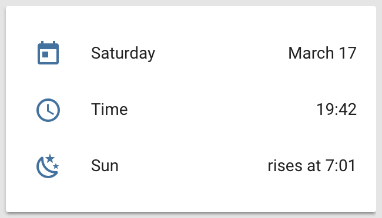
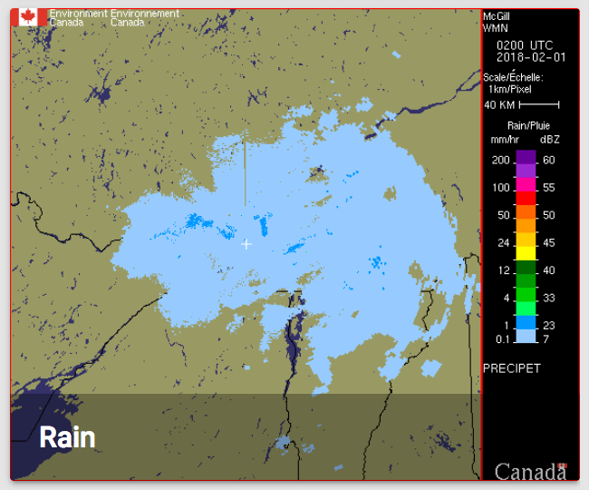
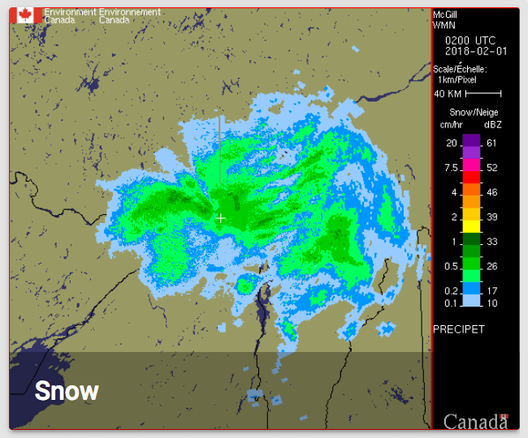
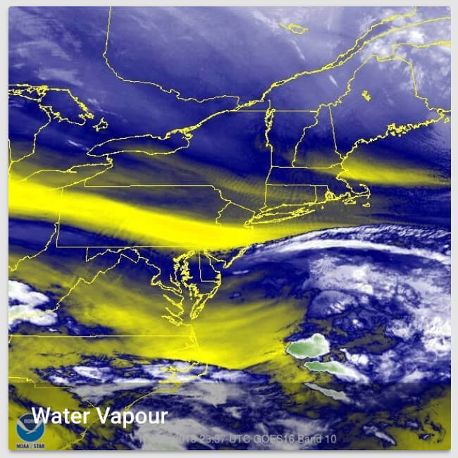
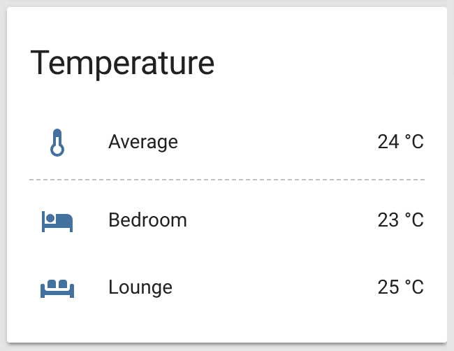
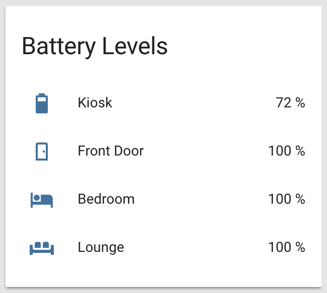
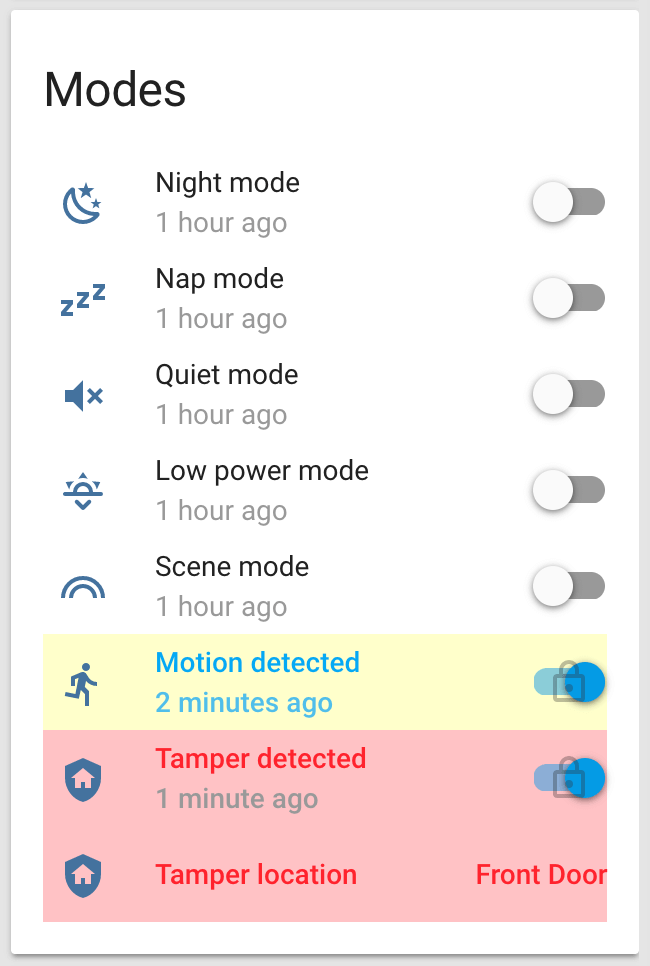
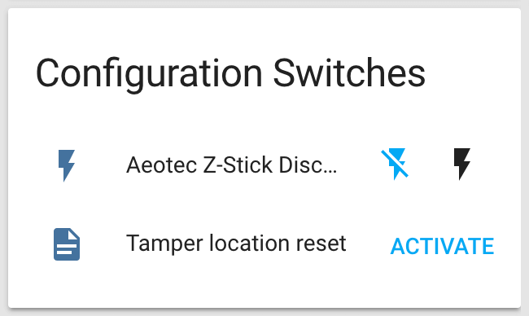

# UI views and groups

To avoid a mess of sensors, the state cards are placed into different pages (views), based on a simple architecture. The goal is always to present only as much info as needed, and data presented must be easy to find and consume.

## Organization

Views are split into 5 pages, organized in a similar fashion as [`/appdaemon/dashboards/`](../appdaemon/dashboards) only with more administrative features.

### [`🏠 ./default.yaml`](default.yaml)

With regular actions, climate control, bus schedules and a pretty picture of the day.

    <figure>
        

            
        

        

            
            
            
            
            
            
        

        <figcaption>
            
<strong>Default view groups.</strong>

        </figcaption>
    </figure>

### [`🔘 ./switchboard.yaml`](switchboard.yaml)

Organized by room and control zone.

    <figure>
        

            
        

        

            
            
            
            
            
        

        <figcaption>
            
<strong>Switchboard view groups.</strong>

        </figcaption>
    </figure>

### [`🌦 ./weather.yaml`](weather.yaml)

With current conditions, forecasts, air quality, radar and satellite maps.

    <figure>
        

            
        

        

            
            
            
            
            
            
            
        

        <figcaption>
            
<strong>Weather view groups.</strong>

        </figcaption>
    </figure>

### [`👀 ./status.yaml`](status.yaml)

Geeky details about Home Assistant, network, battery status and per-location temperature and humidity.

    <figure>
        

            
        

        

            
            
            
            
            
        

        <figcaption>
            
<strong>Status view cards.</strong>

        </figcaption>
    </figure>

### [`⚙ ./configuration.yaml`](configuration.yaml)

States and automation overrides.

    <figure>
        

            
        

        

            
            
        

        <figcaption>
            
<strong>Some configuration view cards.</strong>

        </figcaption>
    </figure>

## Other

### [`🙈 ./invisible.yaml`](invisible.yaml)

For logical groups referenced in code but not displayed in views.

## Customization

The bulk of the customization is done in [`/customize.yaml`](../customize.yaml) and [`/customize_glob.yaml`](../customize_glob.yaml).

The looks of many state cards depend on Custom UI and other templates in [`/www/custom_ui/`](../www/custom_ui).
