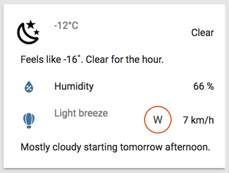
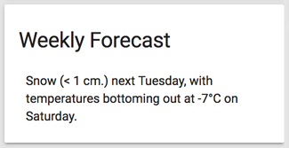

# UI views and groups

To avoid a mess of sensors, the state cards are placed into different pages (views), based on a simple architecture. The goal is always to present only as much info as needed, and data presented must be easy to find and consume.

## Organization

Views are split into 5 pages, organized in a similar fashion as the [tablet dashboard](../appdaemon/dashboards) only with more administrative features.

### Default page

With regular actions, climate control, bus schedules and a pretty picture of the day.

### Switchboard

Organized my room and control zone.

### Weather

With current conditions, forecasts, air quality, radar and satellite maps.

 

### Status

Geeky details about Home Assistant, network, battery status and per-location temperature and humidity.

### Configuration

States and automation overrides.

## Customization

The bulk of the customization is done in [`/customize.yaml`](../customize.yaml) and [`/customize_glob.yaml`](../customize_glob.yaml).

The looks of many state cards depend on Custom UI and other templates in [`/www/custom_ui`](../www/custom_ui).
