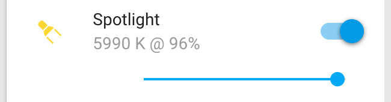
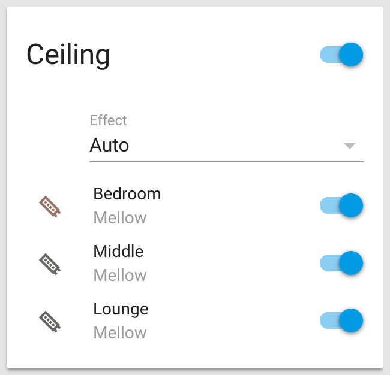
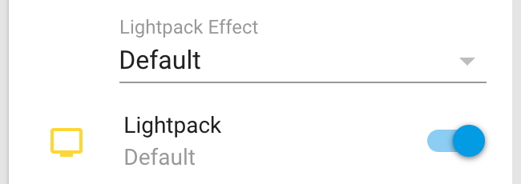
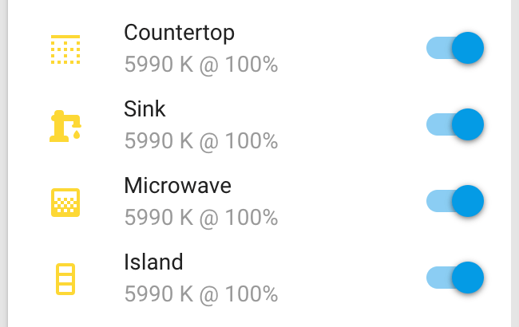
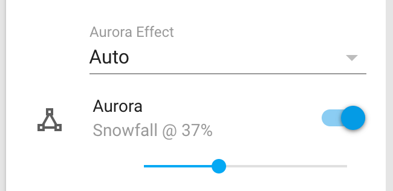

<!-- Header -->
[link-profile]:https://github.com/renemarc
[link-repo]:https://github.com/renemarc/home-assistant-config

<code>[renemarc][link-profile] / **[home-assistant-config][link-repo]** / **lights** /</code>

<strong><a href="https://github.com/renemarc/home-assistant-config">🏠 Home Assistant configuration for a smart-looking place! 😎</a> Be sure to <a href="#" title="star">⭐️</a> or <a href="#" title="fork">🔱</a> this repo!</strong>

<!-- Hero -->
<figure>
    

        
        
        
    

    

        
        
        
        
        
    

</figure>

<h1 align="center">Lights</h1>

## LIFX smart Wi-Fi lights

LIFX devices are directly controlled by Wi-Fi, so no bridges are needed. The devices are first setup via the [LIFX app](https://www.lifx.com/pages/go) where their names are set. For increased stability they then have static IP addresses assigned in the router.

    <figure>
        

            
        

        <figcaption>
            
<strong><a href="https://www.youtube.com/watch?v=TD1358Y3Iv0" title="LIFX promo video">LIFX promo video.</a></strong>

        </figcaption>
    </figure>

### LIFX+ A19 RGBW light bulbs

These [LIFX+ A19 RGBW](https://www.lifx.com/products/lifx-plus) Homekit-compatible light bulbs have a few good points compared to other offerings I was looking at:

- Their colours are vivid and have 1200 lumens of goodness.
- They can be dimmed quite low.
- They are safe to use in humid environments.
- Each has an optional IR illuminator feature to help out security cameras.
- Their colour can be changed even when disabled, which is ideal to have an automation prepare them for the perfect colour and brightness for the next time they are turned on.

They do have couple of minor annoyances however:

- They're expensive. Seriously, $100 CAD **each**? Better wait for a special.
- They sometimes drop off the network for a few seconds, despite having static IP addresses assigned. Not fun.
- There have a slight high-pitch noise. Think old-school power adapter or CRT television high-pitch, but louder. While it feels more noticeable in higher-frequency brightness levels, it occurs more or less randomly when changing their brightness or turning them on. Some of my light fixtures increased this noise, so I only use these bulbs where I cannot hear them regularly, which is a shame. If you have tinitus, this isn't the kind of background noise you want to have. 🤪

    <figure>
        

            
        

        <figcaption>
            
<strong>LIFX light control.</strong>

        </figcaption>
    </figure>

I have their white colour gradually shift from daylight to warm white with varying intensity based on the time of day in [`/automations/cct_lifx.yaml`](../automations/cct_lifx.yaml). They also serve as nightlights through [`/automations/devices/nightlight_on.yaml`](../automations/devices/nightlight_on.yaml), IR illuminators and for some alerts like [`/automations/notifications/front_door_notify.yaml`](../automations/notifications/front_door_notify.yaml).

<a href="#top" title="Back to top">🔝</a>

### LIFX Z RGBW LED strips

A few sets of [LIFX Z RGBW strips](https://www.lifx.com/products/lifx-z) are used as ceiling wash lights and bed underglow lights. These are not the newer HomeKit versions, but the non-HomeKit 3-meters versions were on clearance! Each kit comes with 1-meter strips, and up to 10 strips can be used per 24v 3A controller. Still a bit pricier than DIY solutions, but the design simplicity, time savings, UL-rating and clearance price make this a no-brainer. Plus they look better and brighter than HUE strips thanks to the added white LEDs!

    <figure>
        

            
        

        <figcaption>
            
<strong>LIFX Z strip control.</strong>

        </figcaption>
    </figure>

To make the ceiling strips glow prettily in unison:

1. First, ceiling strips are organized in a dedicated group using the LIFX app.
2. Then [cloud-based scenes](https://www.home-assistant.io/integrations/lifx_cloud/) are defined with the LIFX app and applied to a this ceiling group.
3. Afterwards the scenes' UUID are manually retrieved [via the API](https://api.developer.lifx.com/docs/list-scenes).
4. These scenes UUID are copied over to [`/automations/areas/ceiling_effect.yaml`](../automations/areas/ceiling_effect.yaml).
5. Scenes can then either be changed manually using an **input_select** with [`/automations/areas/ceiling_select.yaml`](../automations/areas/ceiling_select.yaml) or automatically throughout the day with [`/automations/areas/ceiling_schedule.yaml`](../automations/areas/ceiling_schedule.yaml).
6. Finally, to make them extra special, the LIFX app is used to apply a slow motion effect to each LED strip, so that colours gradually move/fade along the strips. So pretty! :-)

Same goes for the bed underglow lights.

This setup works well, but the strips themselves are a bit buggy even before being used with Home Assistant:

- Sometimes the motion stops in one, more or all strips. I have to use the LIFX app to kick them back into motion. It happens daily, which is a bummer. 😒
- Other times a LIFX cloud scene itself is deemed to have a motion programmed, so one strip will get two motion commands applied resulting in a slight stuttering effect. Once again I use the LIFX app, this time to remove the motion from the scene.

<a href="#top" title="Back to top">🔝</a>

## Lightpack dynamic TV bias light

    <figure>
        

            
        

        <figcaption>
            
<strong><a href="https://vimeo.com/30043456" title="ADAlight demo video">ADAlight demo video.</a></strong>

        </figcaption>
    </figure>

The original [Lightpack](https://store.lightpack.tv) is a lighting device placed behind a monitor or computer-connected television screen to provide an Ambilight-like animated glow. Controlled by the [Prismatik](https://github.com/woodenshark/Lightpack) software on an attached computer, it projects lights on the wall in tune with the image displayed on the screen. It helps to reduce eye strain and makes movies and video games that much more immersive. Plus it looks really cool when displaying video artwork!

For my HTPC I use a 100 LED dots DIY build of the [Adalight](https://learn.adafruit.com/adalight-diy-ambient-tv-lighting) ambient TV light project by Adafruit that I crafted years ago. This Adalight device is also compatible with Prismatik. The open source software's development was halted a while back however, but [a kind soul has since forked the project](https://github.com/psieg/Lightpack) and keeps on improving it.

    <figure>
        

            
        

        <figcaption>
            
<strong>Lightpack control.</strong>

        </figcaption>
    </figure>

To allow [the third-party component](https://github.com/kklemm91/Lightpack-HASS) [`/custom_components/`](../custom_components#-lightpacklightpy) to communicate with your Lightpack device, one has to enable the sockets API in Prismatik and optionally add a password. If your IoT LAN is segregated from your TV-connected computer you will also have to play with your firewall rules.

<a href="#top" title="Back to top">🔝</a>

## LimitlessLED (MiLight) controllers with high-CRI CCT LED strips

[LimitlessLED](http://www.limitlessled.com) manufactures LED controllers and devices for many brands, including the popular and affortable [MiLight](http://www.milight.com) devices found on [AliExpress](https://www.aliexpress.com/wholesale?SearchText=milight) and [eBay](https://www.ebay.ca/sch/i.html?_nkw=milight).

The 12v-24v LED controllers receive their commands via a [proprietary RF protocol](http://blog.christophermullins.com/2017/03/18/reverse-engineering-the-new-milightlimitlessled-2-4-ghz-protocol), either through a remote/control panel or through a WiFi bridge. They do not however report back their state, which means that if the light is toggled or modulated by the manufacturer's app, then these changes will not be reflected in Home Assistant and vice versa. Annoying, but hey they are cheap and ubiquitous!

In this case I use a USB-powered [MiLight iBox2 WiFi bridge](http://www.limitlessled.com/shop/wifi-bridge-v6/) to send signals to four [FUT035 CCT controllers](https://www.futlight.com/productdetails.aspx?id=293&typeid=146), each in their own group, that are connected to custom-cut UL-Listed [high-CRI CCT LED strips](http://ledmontreal.com/en/led-strips-without-accessories/24v-led-strips-without-accessories/cct-adjustable-led-strip.html) encased in [light diffusing aluminum profiles](http://ledmontreal.com/en/led-bars-and-profiles-led-montreal/continuous-lighting-aluminum-profile.html) and placed in various locations in the kitchen. 24v DC power is provided by UL-Listed [plug-in and hard-wired adapters](http://ledmontreal.com/en/12v-24v-power-supplies/24v-power-supplies/). While the controllers are CCT, they respond to the newer RGB-CCT signals instead of the older CCT ones, so the FUT035 are paired to the MiLight Bridge using a RGB-CCT virtual remote in MiLight's mobile app.

Aside from regular automations, the lights are controlled physically via a [Flic smart button](https://flic.io): one click turns them on or off, double-click toggles some of them, and hold set thems to full brightness.

    <figure>
        

            
        

        <figcaption>
            
<strong>LimitlessLED control.</strong>

        </figcaption>
    </figure>

Their white colour slowly changes from daylight to warm white depending on the time of day with [`/automations/cct_limitlessled.yaml`](../automations/cct_limitlessled.yaml), and their brightness is also gradually altered on a schedule. At night, they serve as nightlights with [`/automations/devices/nightlight_on.yaml`](../automations/devices/nightlight_on.yaml).

In retrospec, while this setup works I do have reservations. Should I find a better controller solution I will switch away from LimilessLED/MiLight products:

- The iBox2 bridge does not report on the light states, so if I restart Home Assistant while the lights are on or use the MiLight app to make changes, Home Assistant will loose track of the real states.
- The controllers make the light strips flicker when dimmed, more so than any equally dimmed LIFX, Philips, Feit Electric and GE LED bulbs that I own. Not noticeable from straight on, a tiny bit noticeable with peripheral vision, and definitely a lot when using a video camera or Viso System's [Flicker tester app]('http://www.visosystems.com/products/flicker-tester/') it.
- When connecting energized UL-listed DC adapters in the controllers' barrel plug, I get starks flying out of the FUT035. 💥 Every time. And you do have to physically plug/unplug power them to link them to the bridge and to debug the connection. Such a lack of power regulation is not cool. 😠

As an alternative to using the MiLight bridge with its limit of four groups, [Chris Mullins has done a kick-ass job](http://blog.christophermullins.com/2017/02/11/milight-wifi-gateway-emulator-on-an-esp8266/) of reverse-engineering the MiLighs protocols and explains how to easily assemble a DIY bridge using [his open-source project](https://github.com/sidoh/esp8266_milight_hub) to allow you to control as many groups as you want, using MQTT too if you wish. All you'll need is an [ESP8266 WiFi module](https://en.wikipedia.org/wiki/ESP8266), a [nRF24L01+ transceiver](https://hackaday.com/2015/02/23/nordic-nrf24l01-real-vs-fake/) and some prototyping wire, under about $20. I have built one using a [NodeMCU 1.0](https://frightanic.com/iot/comparison-of-esp8266-nodemcu-development-boards/#v1), and will switch to it when the need to add more MiLight groups arises ...unless I find a better solution to replace all of these MiLight controllers with.

<a href="#top" title="Back to top">🔝</a>

## Nanoleaf Aurora smart light panels

    <figure>
        

            
        

        <figcaption>
            
<strong><a href="https://www.youtube.com/watch?v=Nin0NSjp8II" title="Nanoleaf Aurora promo video">Nanoleaf Aurora promo video.</a></strong>

        </figcaption>
    </figure>

What an awesome decorative lighting kit! Makes any place feel like a sophisticated café or designer cocktail bar. 😍

The [Aurora](https://nanoleaf.me) is managed directly through WiFi, so no need for a hub, and is HomeKit compatible.

Like with the LIFX Z light strips, I have scheduled different effects and brightness levels in Home Assistant so that my Aurora changes looks throughout the day. The interface is the same as above, also with a manual override should I prefer a specific effect. The effects do not reside in the cloud however, but directly on the device itself which is nice.

    <figure>
        

            
        

        <figcaption>
            
<strong>Nanoleaf Aurora control.</strong>

        </figcaption>
    </figure>

To program the Aurora:

1. First set up the kit using the [Nanoleaf App](https://nanoleaf.me/en-ca/consumer-led-lighting/products/smarter-series/nanoleaf-cloud/nanoleaf-smarter-series-app/).
1. Through the app, download or create a few effects and give them memorable names.
1. Copy the names into [`/automations/devices/aurora_effect.yaml`](../automations/devices/aurora_effect.yaml).
1. Effects will change automatically throughout the day with [`/automations/devices/aurora_schedule.yaml`](../automations/devices/aurora_schedule.yaml), which an be overridden manually using an **input_select** connected to [`/automations/devices/aurora_select.yaml`](../automations/devices/aurora_select.yaml)

Instant class! 🍸

While a great Canadian product 🇨🇦, it does have very minor drawbacks:

- Installation using either their nails or 3M Command strips (which I used), which isn't seamless.
- They are **very bright**, like those showroom TV sets that are programmed to make the image pop even in a fully lit store, so I run my 9-panels unit at 50% max brightness which makes the stepping brightness changes more noticeable. They would definitely pop in a sunlit environment though, which is cool.
- Buying your first set will make you want to buy more of them. A lot more. It's a bit like crack, but good for you. 😃

<a href="#top" title="Back to top">🔝</a>

## TP-Link HS105 smart Wi-Fi plug mini outlets

A few [TP-Link smart plug mini outlets](http://www.tp-link.com/us/products/details/cat-5516_HS105.html) are used to toggle non-smart light fixtures. These switches are therefore reassigned as lights.

<a href="#top" title="Back to top">🔝</a>

## Customization

The bulk of the customization is done in [`/ui-lovelace.yaml`](../ui-lovelace.yaml), [`/customize.yaml`](../customize.yaml), and [`/customize_glob.yaml`](../customize_glob.yaml).

<!-- Footer -->

<a href="#top" title="Back to top">🔝</a>

<strong>Don't forget to <a href="#" title="star">⭐️</a> or <a href="#" title="fork">🔱</a> this repo! 😃</strong>

[🏠 Home][link-repo]
