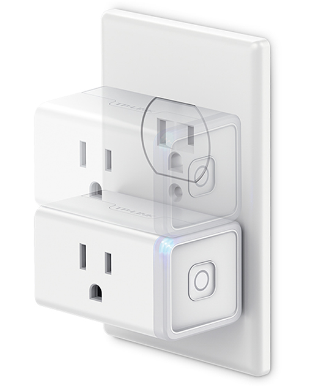

# Switches

## TP-Link HS105 smart Wi-Fi plug mini outlets

**[TP-Link smart plug mini outlets](http://www.tp-link.com/us/products/details/cat-5516_HS105.html)** are used to control dumb devices.

    

 They were first setup with the manufaturer's [Kasa app](https://www.tp-link.com/us/home-networking/smart-home/kasa.html). Then they were assigned static IP addresses in my router to avoid occasional drops due to DHCP renewal limbo.
 
 Still, some of them tend to drop off randomly if placed behind furniture or close to other wi-fi outlets/devices. I am considering moving to Zwave outlets or smart plugs to increase the reliabilty.

## Aeotec Z-Stick blinking light

**[Aeotec Z-Stick disco light](https://community.home-assistant.io/t/aeotec-gen5-z-stick-strobing-led-question-in-hass-io/28635/9)** command line switch to enable or disable the USB dongle's LED light.

 The [Z-Stick Zwave Gen5](https://aeotec.com/z-wave-usb-stick) USB dongle has a colorful but annoying blinking status LED. Great for diagnosis, but otherwise very bright and obnoxious when placed in a visible location!

## Customization

Some customization of switches is done in [`/customize.yaml`](../customize.yaml). For privacy as well as for development and testing purposes any sensitive data is hidden and referenced in the non-commited [`/secrets.yaml`](../secrets-dummy.yaml) file.

