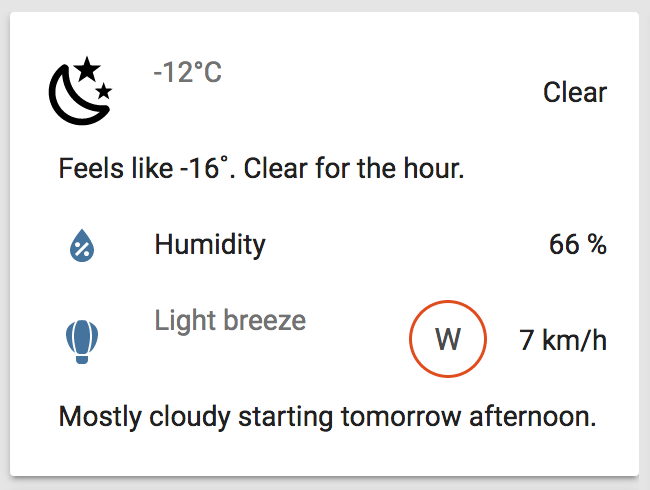
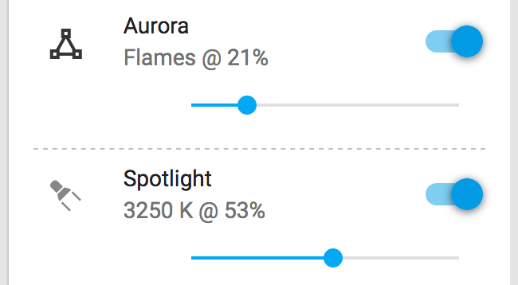
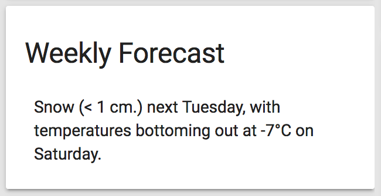

# Custom UI state cards

These third-party state cards are used to adapt the looks of Home Assistant sensors for easier information consumption.

## Custom UI elements

**[Custom UI elements](https://github.com/andrey-git/home-assistant-custom-ui)** help improve the display of sensors and jazz up the interface a bit.

    

## Horizontal line state card

**[Horizontal line state card](https://github.com/covrig/homeassistant-hline)** to visually separate long lists of sensors.

    

## Value-only state card

**[Value-only state card](https://community.home-assistant.io/t/display-only-text-in-card/20536/26)** for wordy sensor states.

    

## Customization

Actual customization of state cards is done in [`/customize.yaml`](../../customize.yaml) and [`/customize_glob.yaml`](../../customize_glob.yaml).
