# Screenshots

Screenshots of UI elements features in this repository.

## Cards

    <figure>
        

            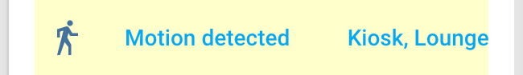
            
        

        <figcaption>
            
<strong>Warning card.</strong>

        </figcaption>
    </figure>

    <figure>
        

            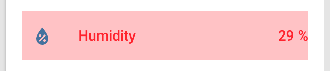
            
        

        <figcaption>
            
<strong>Critical card.</strong>

        </figcaption>
    </figure>

    <figure>
        

            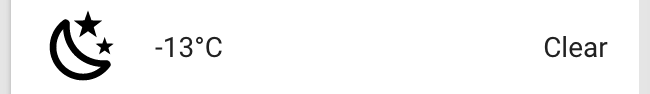
        

        <figcaption>
            
<strong>Secondary Title card, used to replace the sensor name with the temperature's value.</strong>

        </figcaption>
    </figure>

    <figure>
        

            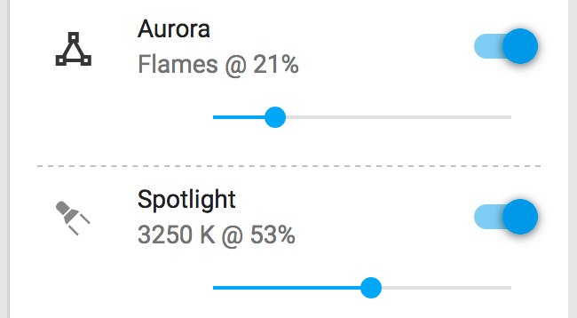
        

        <figcaption>
            
<strong>Horizontal line state card.</strong>

        </figcaption>
    </figure>

    <figure>
        

            
        

        <figcaption>
            
<strong>LIFX light control.</strong>

        </figcaption>
    </figure>

    <figure>
        

            
        

        <figcaption>
            
<strong>Lightpack control.</strong>

        </figcaption>
    </figure>

    <figure>
        

            
        

        <figcaption>
            
<strong>LimitlessLED control.</strong>

        </figcaption>
    </figure>

    <figure>
        

            
        

        <figcaption>
            
<strong>Nanoleaf Aurora control.</strong>

        </figcaption>
    </figure>

    <figure>
        

            
            
        

        <figcaption>
            
<strong>NOAA satellite images for North-America's East Coast.</strong>

        </figcaption>
    </figure>

## Area Groups

    <figure>
        

            
            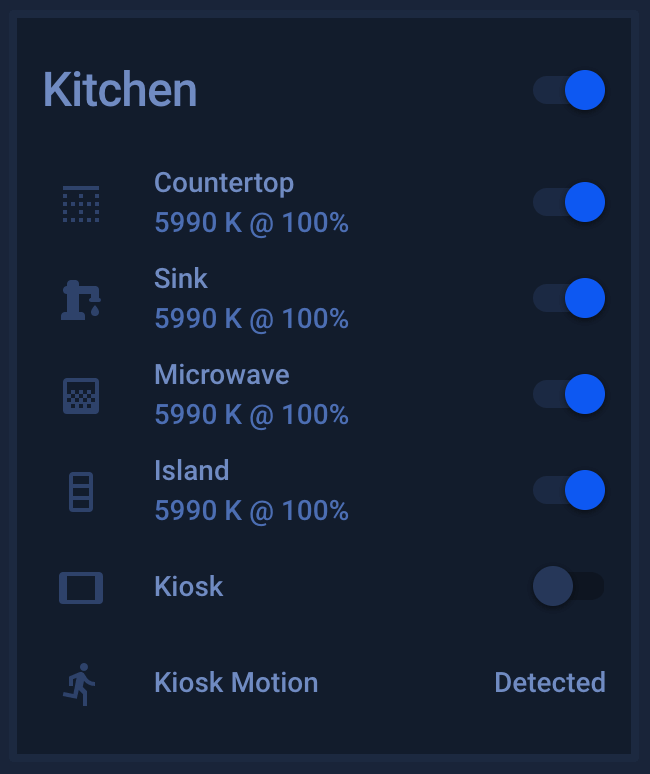
        

        <figcaption>
            
<strong>Area group.</strong>

        </figcaption>
    </figure>

    <figure>
        

            
            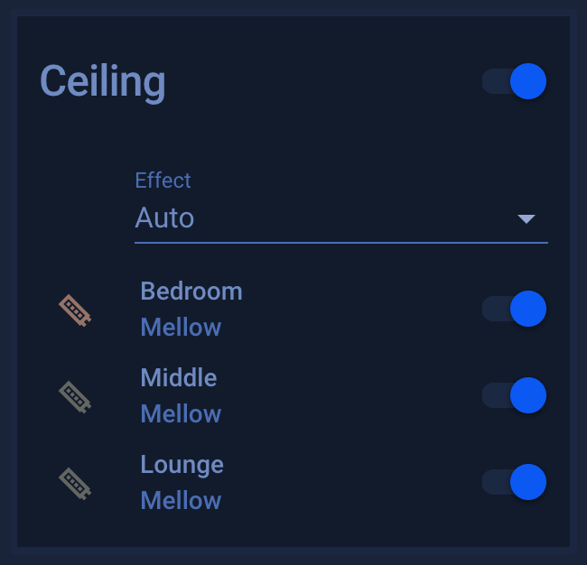
        

        <figcaption>
            
<strong>Ceiling Wash Light group.</strong>

        </figcaption>
    </figure>

    <figure>
        

            
            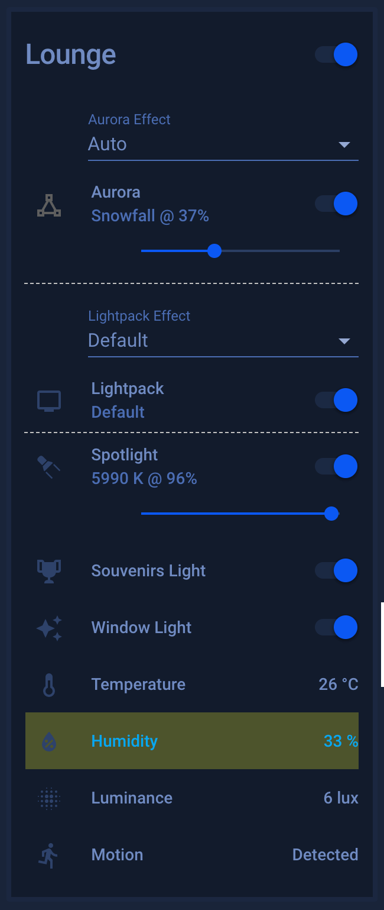
        

        <figcaption>
            
<strong>Lounge group.</strong>

        </figcaption>
    </figure>

    <figure>
        

            
            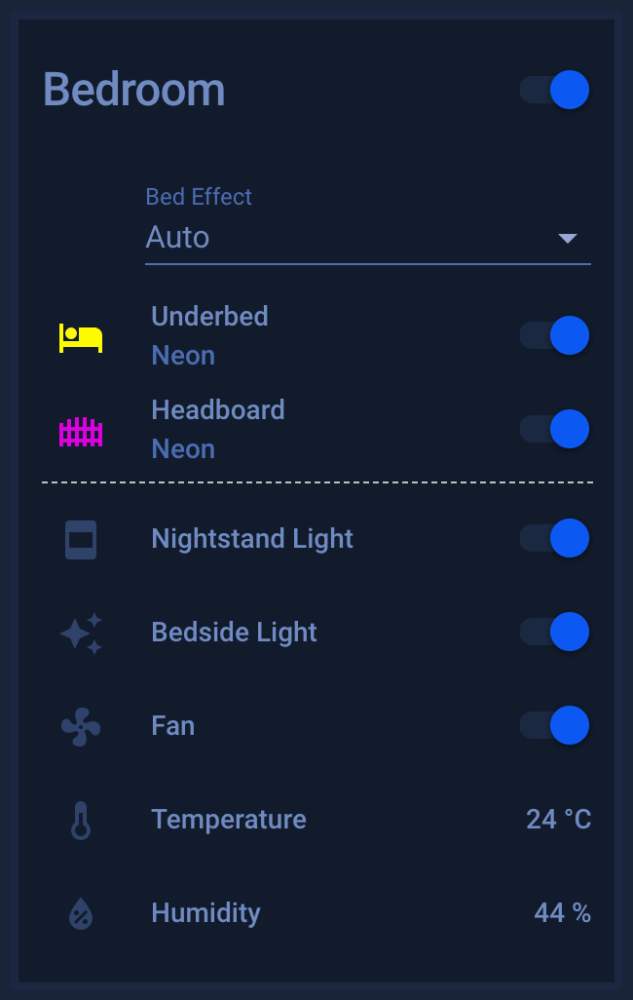
        

        <figcaption>
            
<strong>Bedroom group.</strong>

        </figcaption>
    </figure>

    <figure>
        

            
            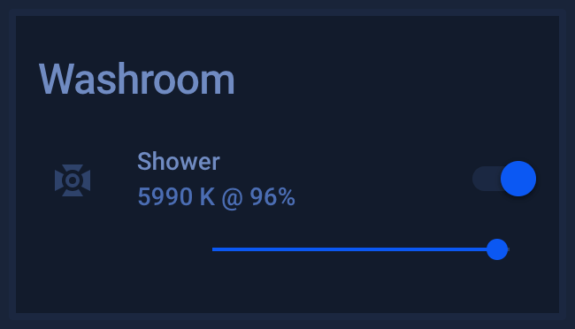
        

        <figcaption>
            
<strong>Washroom group.</strong>

        </figcaption>
    </figure>

## Sensors Groups

    <figure>
        

            
            
        

        <figcaption>
            
<strong>Climate Control group.</strong>

        </figcaption>
    </figure>
    <figure>
        

            
            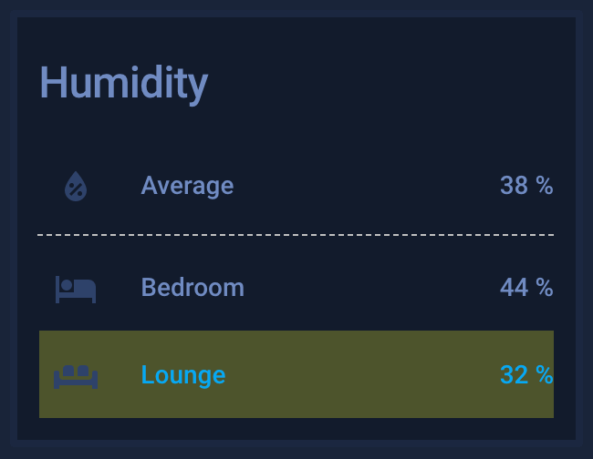
        

        <figcaption>
            
<strong>Humidity group.</strong>

        </figcaption>
    </figure>
    <figure>
        

            
            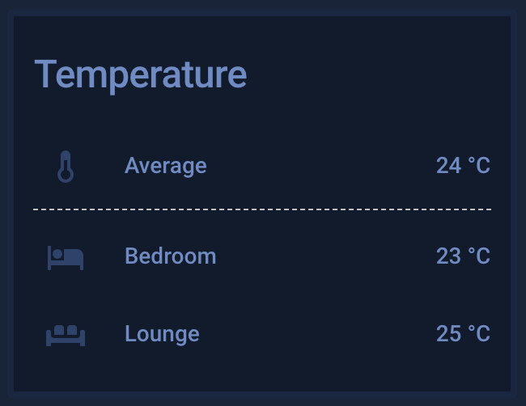
        

        <figcaption>
            
<strong>Temperature group.</strong>

        </figcaption>
    </figure>

    <figure>
        

            
            
        

        <figcaption>
            
<strong>Battery Levels group.</strong>

        </figcaption>
    </figure>

    <figure>
        

            
            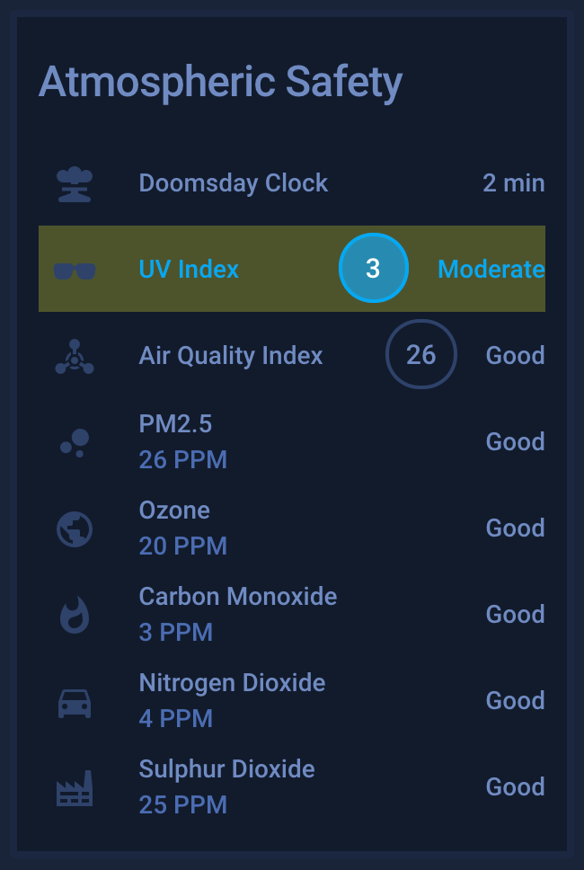
        

        <figcaption>
            
<strong>Atmospheric Safety group.</strong>

        </figcaption>
    </figure>

    <figure>
        

            
            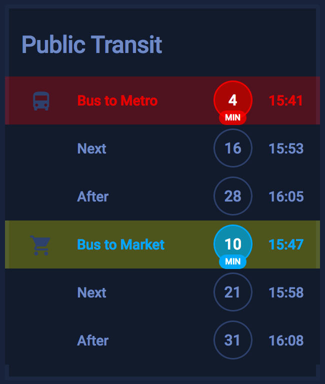
        

        <figcaption>
            
<strong>Public Transit group.</strong>

        </figcaption>
    </figure>

    <figure>
        

            
            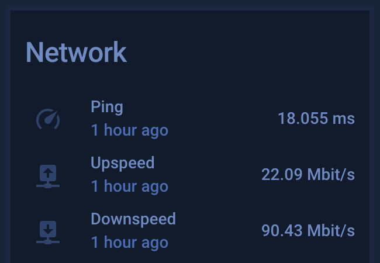
        

        <figcaption>
            
<strong>Network group.</strong>

        </figcaption>
    </figure>

    <figure>
        

            
            
        

        <figcaption>
            
<strong>Security group.</strong>

        </figcaption>
    </figure>

    <figure>
        

            
            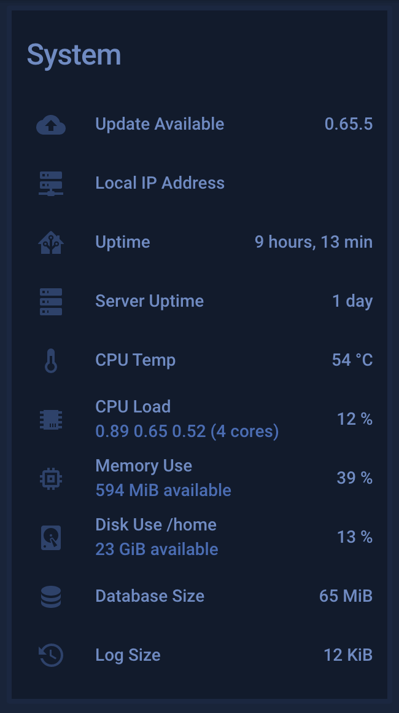
        

        <figcaption>
            
<strong>System group.</strong>

        </figcaption>
    </figure>

    <figure>
        

            
            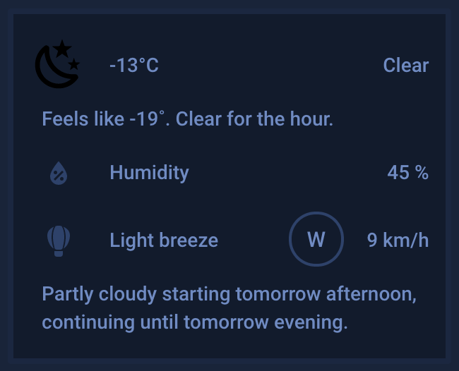
        

        

            
            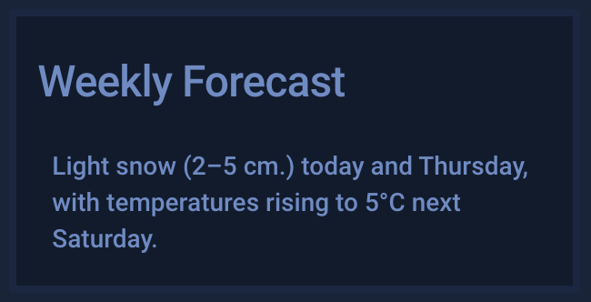
        

        <figcaption>
            
<strong>Weather groups.</strong>

        </figcaption>
    </figure>

    <figure>
        

            
            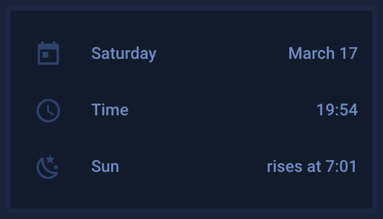
        

        <figcaption>
            
<strong>Calendar group.</strong>

        </figcaption>
    </figure>

## Menus

    <figure>
        

            
        

        

            
        

        

            
        

        

            
        

        

            
        

        <figcaption>
            
<strong>Menus.</strong>

        </figcaption>
    </figure>

## Various

    <figure>
        

            
            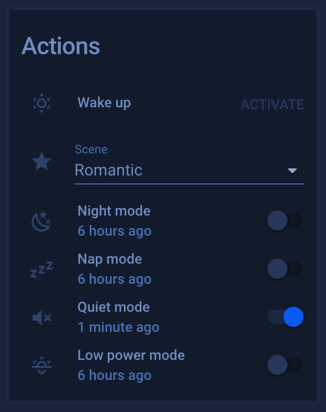
        

        <figcaption>
            
<strong>Actions group.</strong>

        </figcaption>
    </figure>

    <figure>
        

            
            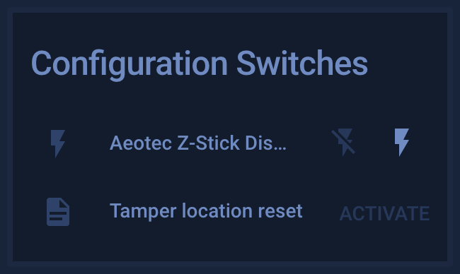
        

        <figcaption>
            
<strong>Configuration group.</strong>

        </figcaption>
    </figure>

    <figure>
        

            
            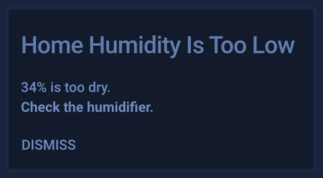
        

        <figcaption>
            
<strong>Notifications.</strong>

        </figcaption>
    </figure>

    <figure>
        

            
            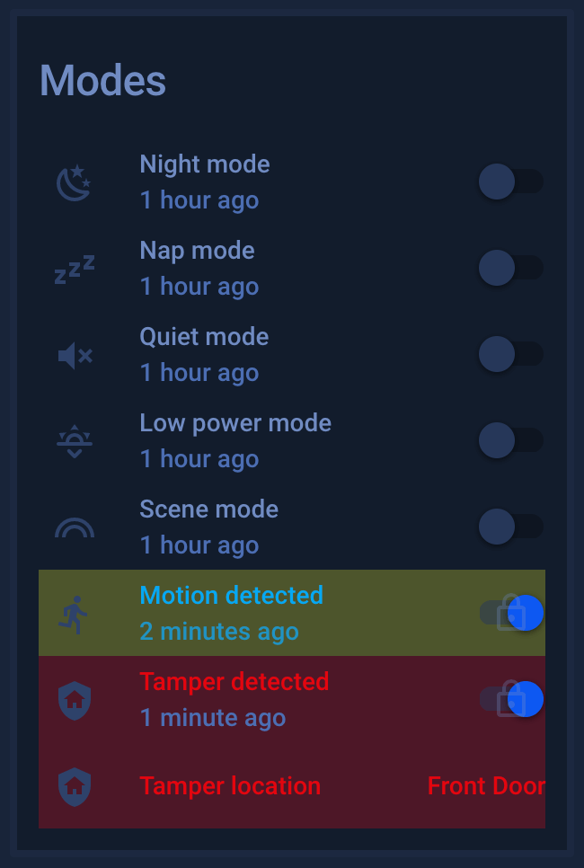
        

        <figcaption>
            
<strong>Modes group.</strong>

        </figcaption>
    </figure>

    <figure>
        

            
            
        

        <figcaption>
            
<strong>Presence group.</strong>

        </figcaption>
    </figure>

